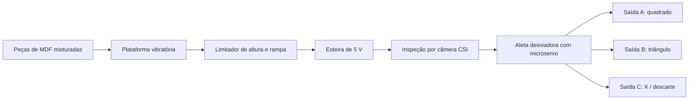
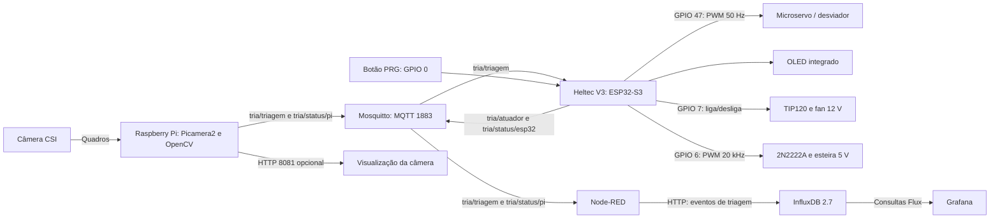
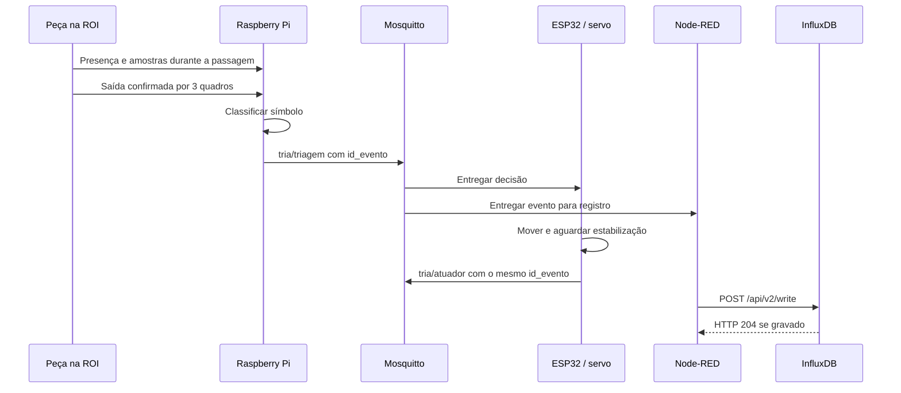

# TRIA - Triagem Visual Integrada de Componentes

**Trabalho de Conclusão da Capacitação PNAAT 2026 · Cenário 2 · Equipe Os guri do pinati**

O TRIA é uma prova de conceito física para organizar a triagem de componentes que chegam misturados, em posições variadas ou sobrepostos a uma linha de manufatura. Uma plataforma vibratória e uma rampa de MDF alimentam uma esteira; um Raspberry Pi identifica os símbolos das peças por visão computacional; um ESP32 posiciona um desviador em três saídas. As decisões circulam por MQTT na rede local e são registradas e visualizadas na stack **MING: Mosquitto, InfluxDB, Node-RED e Grafana**.

Este manual reúne a arquitetura implementada, as conexões elétricas, a preparação do ambiente, a calibração e os procedimentos de verificação.

## Sumário

1. [Problema, solução e escopo](#1-problema-solução-e-escopo)
2. [Arquitetura e funcionamento](#2-arquitetura-e-funcionamento)
3. [Organização do código](#3-organização-do-código)
4. [Lista de materiais](#4-lista-de-materiais)
5. [Montagem elétrica e mecânica](#5-montagem-elétrica-e-mecânica)
6. [Pré-requisitos e preparação](#6-pré-requisitos-e-preparação)
7. [Instalação e configuração](#7-instalação-e-configuração)
8. [Calibração e operação](#8-calibração-e-operação)
9. [Comunicação MQTT e armazenamento](#9-comunicação-mqtt-e-armazenamento)
10. [Testes e critérios de aceite](#10-testes-e-critérios-de-aceite)
11. [Diagnóstico de problemas](#11-diagnóstico-de-problemas)
12. [Reprodutibilidade e limites da entrega](#12-reprodutibilidade-e-limites-da-entrega)
13. [Equipe, referências e licença](#13-equipe-referências-e-licença)

## 1. Problema, solução e escopo

O [Cenário 2](docs/Cen%C3%A1rios.pdf), página 1, descreve peças usinadas ou impressas em 3D transportadas de forma misturada, com acúmulo, sobreposição e orientação aleatória. Isso dificulta a alimentação organizada das estações seguintes. O TRIA representa esse problema em escala de laboratório com placas de MDF e símbolos contrastantes.

| Necessidade do cenário | Resposta da PoC |
|---|---|
| Reduzir contato e sobreposição antes da inspeção | Plataforma de MDF vibrada por uma fan, saída com limitador de altura e rampa até a esteira |
| Identificar modelos misturados | Câmera CSI e processamento local com Python/OpenCV |
| Encaminhar cada tipo à saída adequada | Decisão por MQTT e aleta acionada por microservo |
| Acompanhar e auditar o processo | Identificador de evento, registro temporal e dashboard |

| Símbolo central da placa | Classe exata no MQTT | Destino | `defeito` |
|---|---|---|---|
| Quadrado | QUADRADO | A | false |
| Triângulo | TRIÂNGULO | B | false |
| X | QUADRADO_COM_X | C, descarte | true |

Os nomes das classes preservam o [levantamento de requisitos](docs/TRIA_Entrega_1_Levantamento_de_Requisitos_PoC_Fisica.pdf). A implementação atual reconhece o **símbolo central**, após localizar a placa de MDF. O X representa uma condição de descarte da demonstração; o sistema não diagnostica defeitos físicos arbitrários.

**Incluído:** pré-separação acionada por botão, transporte com velocidade ajustável por PWM, classificação dos três símbolos, comunicação local, desviador, OLED e supervisão de eventos. **Fora do escopo:** reconhecimento de peças industriais arbitrárias, treinamento de redes neurais, certificação industrial, integração com CLP/MES/ERP e sensores dedicados de presença ou posição. O rádio LoRa da placa Heltec não é utilizado.

A redução de gargalos é o benefício pretendido. Ganhos de produtividade e percentuais de acerto precisam ser demonstrados pelos ensaios da seção 10; não são resultados garantidos pela arquitetura.

## 2. Arquitetura e funcionamento

### 2.1 Fluxo físico



A pré-separação é mecânica. O classificador pressupõe uma placa identificável por passagem; peças que continuam sobrepostas ou sem intervalo podem ser interpretadas como uma única passagem.

### 2.2 Fluxo de dados e controle



O Pi realiza a visão e o ESP32 controla os atuadores. O broker MQTT é necessário para ligar esses dois nós. Node-RED, InfluxDB e Grafana formam o caminho de registro; o dashboard não decide nem autoriza a movimentação do servo. O flow atual não assina as confirmações do atuador nem o status do ESP32; esses tópicos podem ser inspecionados com o assinante MQTT da seção 7.

### 2.3 Ciclo implementado

1. O ESP32 inicializa OLED, servo, botão e motores. **A esteira começa a operar com o percentual configurado, antes da conexão MQTT.** A fan inicia desligada.
2. Cada novo toque no botão PRG alterna a fan entre ligada e desligada, com debounce de 30 ms. Não é necessário manter o botão pressionado.
3. O Pi localiza o MDF na região de interesse, ou **ROI**, por cor HSV, corrige a perspectiva e coleta amostras do símbolo durante a passagem.
4. A presença é confirmada após três quadros consecutivos. **A classificação da passagem e a publicação acontecem quando a ausência é confirmada por três quadros**, depois que a peça sai da ROI. O processamento combina informações das amostras coletadas.
5. Se houver classificação válida, o Pi publica um evento com classe, destino e ID. Caso contrário, registra a falha no terminal e libera o próximo ciclo, sem enviar uma decisão de descarte automática.
6. O ESP32 recebe o destino, comanda o ângulo correspondente, aguarda o tempo de estabilização configurado e publica uma confirmação com o mesmo ID.
7. Paralelamente, o Node-RED valida e deduplica o evento, grava no InfluxDB e o Grafana consulta os dados.



O servo é comandado **ao receber a mensagem**. O campo `instante_atuacao` ainda não agenda movimentos. A confirmação indica a conclusão da rotina de software, sem sensor que comprove posição ou passagem física. Por isso, distância, velocidade e intervalo entre peças precisam ser calibrados.

## 3. Organização do código

```text
TCC-PNAAT/
├── README.md                         Manual de reprodução
├── LICENSE                           Licença MIT
├── docs/                             Apostila, cenário, requisitos e roteiro do pitch
├── pi/
│   ├── main.py                       Câmera, ROI, ciclo de passagem e interface
│   ├── classifier.py                 Segmentação e classificação geométrica
│   ├── mqtt_publisher.py             Publicação de decisões e status
│   ├── config.py                     Rede e parâmetros de visão/temporização
│   ├── requirements.txt              Dependências Python
│   ├── evaluate_videos.py            Avaliação de vídeos e exportação CSV
│   └── tests/
│       ├── test_classifier.py        Testes de imagens, estados e vídeo
│       ├── images/                   Imagens identificadas por classe
│       └── videos/                   MP4 de ensaio e gabaritos misturado*.txt
├── tria-esp/
│   ├── CMakeLists.txt                Projeto ESP-IDF
│   ├── dependencies.lock            Versões resolvidas do firmware
│   ├── main/                        Inicialização, menuconfig e dependências
│   ├── components/                  Módulos de atuação, rede e display
│   ├── LIGACAO_MICRO_SERVO.md        Guia complementar do servo
│   └── .devcontainer/               Ambiente opcional de desenvolvimento
└── ming/
    ├── docker-compose.yml           Quatro serviços, rede e volumes
    ├── mosquitto/mosquitto.conf      Broker MQTT
    ├── nodered/flows.json            Fluxo provisionado de eventos
    ├── nodered/data/                Dados locais de execução, ignorados pelo Git
    └── grafana/
        ├── datasources/influxdb.yml  Fonte de dados
        ├── provisioning/dashboards.yml
        └── dashboards/tria-dashboard.json
```

| Responsabilidade | Arquivo ou módulo | Relação com os requisitos |
|---|---|---|
| Captura e controle de passagem | [main.py](pi/main.py) | RF01, RF04, RNF05 |
| Classificação por geometria do símbolo | [classifier.py](pi/classifier.py) | RF02, RF03 |
| Contrato de publicação MQTT | [mqtt_publisher.py](pi/mqtt_publisher.py) | RF04 |
| Conversão de destino em ângulo | [tria_actuator.c](tria-esp/components/tria_actuator/tria_actuator.c) | RF05, RF06 |
| PWM do servo | [servo.c](tria-esp/components/servo/servo.c) | RF05 |
| Botão e fan | [vibration.c](tria-esp/components/vibration/vibration.c) | RF07 |
| PWM da esteira | [conveyor.c](tria-esp/components/conveyor/conveyor.c) | Transporte e calibração |
| Wi-Fi, MQTT e supervisão | [tria_network.c](tria-esp/components/tria_network/tria_network.c) | RF04, RNF04 |
| OLED integrado | [tria_display.c](tria-esp/components/tria_display/tria_display.c) | Diagnóstico local |
| Integração dos módulos | [main.c](tria-esp/main/main.c) | RF10 |
| Validação, deduplicação e persistência | [flows.json](ming/nodered/flows.json) | RF08, RNF05 |
| Painéis e histórico | [tria-dashboard.json](ming/grafana/dashboards/tria-dashboard.json) | RF09 |

Os parâmetros de montagem do ESP32 ficam em [Kconfig.projbuild](tria-esp/main/Kconfig.projbuild). Configure-os por `idf.py menuconfig`; o exemplo antigo de definição do pino no guia complementar do servo não representa a configuração modular atual.

## 4. Lista de materiais

| Quantidade | Item | Especificação ou finalidade |
|---|---|---|
| 1 | Raspberry Pi 5, 8 GB | Nó de visão; fonte e refrigeração compatíveis com o kit |
| 1 | microSD e leitor | Kit previsto com cartão de 128 GB; sistema e repositório |
| 1 | Câmera CSI V1.3, 5 MP | Cabo adaptador compatível com o conector do Pi 5 |
| 1 | Heltec WiFi LoRa 32 V3 | ESP32-S3, OLED e botão PRG integrados; cabo USB de dados |
| 1 | Esteira com motor DC de 5 V | Transporte das peças; corrente nominal e de partida a medir |
| 1 | Transistor NPN 2N2222A | Chaveamento do motor da esteira |
| 1 | Fan de 12 V | Atuador de vibração da plataforma; corrente a verificar |
| 1 | Transistor Darlington NPN TIP120 | Chaveamento da fan |
| 2 | Resistores de 2 kΩ | Um em série com a base de cada transistor, conforme informado pela equipe |
| 2 | Diodos de proteção | Um em paralelo com cada carga; modelos/correntes não informados |
| 1 | Microservo de 9 g | Desviador; modelo comercial não informado, alimentação de 5 V conforme guia de montagem do projeto |
| Conforme montagem | Fontes reguladas de 5 V e 12 V | Capacidade dimensionada para partida dos motores e movimentação do servo |
| 1 conjunto | Plataforma, teto limitador e rampa de MDF | Pré-separação e alimentação da esteira |
| 1 conjunto | Aleta, suporte e três saídas | Encaminhamento A/B/C |
| 1 conjunto | Placas de MDF com quadrado, triângulo e X | Símbolos escuros e contrastantes, compatíveis com as imagens de referência |
| Conforme montagem | Fios, conectores e fixação | Conexões firmes, condutores adequados à corrente e base estável |
| 1 conjunto | Suporte da câmera, iluminação e fundo fosco | Inspeção sem sombras fortes, reflexos ou vibração da câmera |
| 1 | Rede local e computador de apoio | Wi-Fi de 2,4 GHz para o ESP32; computador pode hospedar MING e gravar o firmware |
| 1 | Multímetro | Verificação de tensão, continuidade e corrente conforme o procedimento do instrumento |

**Dados da bancada:** 5 V e 12 V são tensões, não correntes. O percentual de PWM informado para a esteira é **aproximadamente 65%**; o padrão do código é **100%**. Correntes, fabricantes/encapsulamentos dos transistores, modelos dos diodos e modelo exato do servo ainda precisam ser registrados para reproduzir também o dimensionamento elétrico.

## 5. Montagem elétrica e mecânica

### 5.1 Convenções e alimentação

O esquema abaixo foi reconstruído a partir dos componentes informados pela equipe e dos GPIOs definidos no firmware. Ele especifica as ligações funcionais; a montagem real deve ser conferida antes da energização. **B, C e E** significam **base, coletor e emissor**. Os números de GPIO são os sinais IO da placa, não a posição física dos pinos no conector.

- Monte e altere conexões com todas as fontes desligadas. Alimente a Heltec por USB e as cargas por fontes externas.
- Una o negativo das fontes das cargas ao GND da Heltec. Esse é o **GND comum** dos transistores e do servo. Não una os positivos de 5 V e 12 V nem coloque fontes de 5 V independentes em paralelo.
- Os GPIOs fornecem sinais de 3,3 V. Não conecte motores diretamente aos GPIOs e não aplique 5 V ou 12 V a eles.
- O Pi usa sua própria fonte e conversa com a Heltec pela rede; não é necessária uma ligação GPIO ou GND adicional entre Pi e Heltec para essa comunicação.
- Dimensione cada fonte pela corrente exigida pelas cargas simultâneas, incluindo a partida. O percentual de PWM não elimina o pico de corrente do motor.

### 5.2 Mapa completo de sinais

| Sinal | GPIO padrão | Ligação / uso | Comportamento |
|---|---:|---|---|
| Esteira | 6 | Resistor R1 de 2 kΩ → base de Q1, 2N2222A | PWM de 20 kHz, resolução de 10 bits; timer 1, canal 1 |
| Fan vibratória | 7 | Resistor R2 de 2 kΩ → base de Q2, TIP120 | Saída digital: alto liga, baixo desliga |
| Microservo | 47 | Fio de sinal do servo | PWM de 50 Hz, resolução de 14 bits; timer 0, canal 0 |
| Botão PRG | 0 | Já integrado à Heltec | Entrada com pull-up, pressionamento em nível baixo; alterna a fan |
| OLED SDA | 17 | Interno da placa | Dados I²C |
| OLED SCL | 18 | Interno da placa | Clock I²C |
| OLED reset | 21 | Interno da placa | Reset do display |
| Controle Vext/OLED | 36 | Interno da placa | Alimentação controlada em nível baixo |
| Referência elétrica | GND | Emissores, negativo das fontes e GND do servo | Terra comum |

Não é necessário refazer a fiação do OLED ou do botão integrado. Preserve seus GPIOs. Para outra revisão de placa, confira o [pinout oficial da Heltec V3](https://heltec.org/project/wifi-lora-32-v3/) antes de reaproveitar este mapa.

### 5.3 Esteira: motor de 5 V com 2N2222A

Q1 funciona como chave no lado negativo da carga. O PWM varia o tempo em que essa chave conduz.

```text
                         +5 V da fonte da esteira
                                   |
                         +---------+---------+
                         |                   |
                    (+) MOTOR          K (faixa)
                    (-) ESTEIRA           D1
                         |                A
                         |                   |
                         +---------+---------+
                                   |
                                   C
GPIO 6 ---- R1 = 2 kohm ---- B   Q1: 2N2222A
                                   E
                                   |
GND Heltec ------------------------+---- negativo da fonte de 5 V
```

D1 é um diodo entre os mesmos dois nós do motor: **cátodo K/faixa no +5 V; ânodo A no coletor/negativo do motor**. Ele fica reversamente polarizado durante a alimentação normal.

| Origem | Destino |
|---|---|
| Positivo da fonte de 5 V | Positivo do motor e cátodo de D1 |
| Negativo do motor | Coletor de Q1 e ânodo de D1 |
| GPIO 6 da Heltec | Uma ponta de R1, 2 kΩ |
| Outra ponta de R1 | Base de Q1 |
| Emissor de Q1 | GND comum |
| Negativo da fonte de 5 V | GND comum e GND da Heltec |

**Identificação dos terminais:** não adote uma sequência de pernas apenas pelo nome “2N2222A”. Confira fabricante e encapsulamento. O [datasheet ST do 2N2222A](https://www.st.com/resource/en/datasheet/2n2222a.pdf) descreve a versão metálica TO-18; ele não deve ser usado como pinagem automática de uma peça plástica de outro fabricante.

**Verificação do resistor de base:** com a aproximação de 3,3 V no GPIO e 0,8 V entre base e emissor, R1 de 2 kΩ fornece cerca de **(3,3 − 0,8) / 2000 = 1,25 mA**. Isso não comprova saturação para a corrente do motor. Meça a corrente de partida/carga, a tensão coletor-emissor durante a condução e o aquecimento. Se Q1 não conduzir adequadamente, o acionamento precisa ser redimensionado considerando os limites do GPIO e do transistor; não reduza R1 sem essa verificação. O datasheet especifica condições de corrente de base para seus valores de saturação.

### 5.4 Fan vibratória: 12 V com TIP120

```text
                         +12 V da fonte da fan
                                   |
                         +---------+---------+
                         |                   |
                      (+) FAN          K (faixa)
                      (-) 12 V            D2
                         |                A
                         |                   |
                         +---------+---------+
                                   |
                                   C
GPIO 7 ---- R2 = 2 kohm ---- B   Q2: TIP120
                                   E
                                   |
GND Heltec ------------------------+---- negativo da fonte de 12 V
```

| Origem | Destino |
|---|---|
| Positivo da fonte de 12 V | Positivo da fan e cátodo/faixa de D2 |
| Negativo da fan | Coletor de Q2 e ânodo de D2 |
| GPIO 7 da Heltec | Uma ponta de R2, 2 kΩ |
| Outra ponta de R2 | Base de Q2 |
| Emissor de Q2 | GND comum |
| Negativo da fonte de 12 V | GND comum e GND da Heltec |

A ligação considera os dois fios de alimentação da fan. Se ela possuir fios extras de tacômetro ou controle, identifique-os pelo fabricante; eles não são usados pelo firmware atual. A fan é ligada/desligada por GPIO, **sem PWM de velocidade**.

No [TIP120 da onsemi em TO-220](https://www.onsemi.com/pdf/datasheet/tip120-d.pdf), os terminais são 1 = base, 2 = coletor e 3 = emissor; a aba metálica está ligada ao coletor. Confira a orientação no desenho do encapsulamento. O Darlington apresenta queda de tensão durante a condução: verifique se a fan parte e se o transistor permanece dentro de seus limites térmicos.

### 5.5 Servo e diodos de proteção

| Ligação do microservo | Conectar a |
|---|---|
| VCC, normalmente vermelho | Fonte regulada de 5 V, desde que compatível com o modelo do servo |
| GND, normalmente marrom/preto | GND comum |
| Sinal, normalmente laranja/amarelo | GPIO 47 |

Confirme as cores no servo utilizado. O firmware gera pulsos de 500–2500 µs para 0–180°; os padrões A/B/C de 45°/90°/135° correspondem aproximadamente a 1000/1500/2000 µs. Teste essas posições inicialmente sem a aleta presa, sem forçar os batentes. O peso de 9 g não identifica a faixa elétrica ou o curso de um modelo específico.

Os diodos D1/D2 informados pela equipe precisam suportar a tensão reversa e a corrente de recirculação das respectivas cargas. Para D1, verifique também a adequação ao chaveamento de 20 kHz; não assuma que qualquer diodo retificador serve. Registre os modelos instalados. O diodo interno do TIP120 não substitui a proteção externa em paralelo com a carga mostrada aqui.

Para uma réplica, resistores de 10 kΩ entre base e emissor podem manter Q1/Q2 desligados durante a inicialização, e desacoplamento próximo às cargas pode reduzir perturbações. Esses itens são **recomendações de montagem**, não componentes confirmados na bancada original. Um capacitor próximo ao servo deve respeitar polaridade e tensão nominal, conforme o [guia complementar](tria-esp/LIGACAO_MICRO_SERVO.md).

### 5.6 Montagem mecânica

1. Fixe a fan à plataforma de MDF de modo que a vibração seja transferida à base. Proteja as partes girantes e mantenha fios fora da trajetória das peças.
2. Monte o teto limitador na saída. Para placas uniformes de espessura `t`, ajuste uma folga maior que uma placa e menor que duas empilhadas, verificando o deslizamento real e a tolerância do material. Ajuste a largura do canal para passagem individual.
3. Posicione a rampa para entregar as peças sobre a esteira com o símbolo visível, evitando empilhamento na transferência.
4. Fixe a câmera acima da esteira, separada da estrutura vibratória, com fundo fosco e luz difusa. A placa e sua marca devem caber na ROI durante a inspeção.
5. Instale a aleta e identifique fisicamente as saídas A, B e C. Reserve percurso **depois da saída da ROI** para permitir classificação, comunicação e movimento do servo.
6. Ajuste o espaçamento: a peça anterior deve alcançar e liberar o desviador antes de uma nova decisão mudar sua posição.

Os arquivos de corte e as dimensões mecânicas não estão versionados. Para reproduzir a geometria, registre espessura/tamanho das placas, folga do teto, largura/inclinação da rampa, altura da câmera, ROI, distância até a aleta e ângulos calibrados. O procedimento acima permite adaptar o mecanismo, mas não constitui desenho dimensional da bancada original.

## 6. Pré-requisitos e preparação

### 6.1 Distribuição de referência

| Equipamento | Preparar antes da instalação |
|---|---|
| Raspberry Pi | Raspberry Pi OS 64 bits, Python ≥ 3.10, acesso ao terminal, câmera CSI conectada e rede local |
| Computador de apoio | Git, navegador, Docker com Compose v2 e ESP-IDF 5.5.5 para ESP32-S3 |
| Heltec V3 | Cabo USB de dados e porta serial identificada; fontes das cargas desligadas durante a gravação |
| Rede | Pi, ESP32 e computador acessíveis entre si; SSID de 2,4 GHz com WPA2 compatível e sem isolamento entre clientes |

O computador de apoio hospeda a stack MING neste roteiro. É possível hospedá-la no Pi com Docker compatível com ARM64, após conferir carga de CPU/memória e disponibilidade das imagens. A primeira instalação requer Internet para baixar pacotes; a operação usa a rede local.

1. Prepare o microSD com Raspberry Pi OS 64 bits usando o [Raspberry Pi Imager](https://www.raspberrypi.com/documentation/computers/getting-started.html). Configure usuário, rede e acesso SSH, se necessário. Use o usuário criado; não presuma uma senha padrão.
2. Conecte a câmera com o Pi desligado, usando o cabo correto para o Pi 5 e a orientação indicada no [manual da câmera](https://www.raspberrypi.com/documentation/accessories/camera.html).
3. No Windows, instale e inicie o [Docker Desktop com backend WSL 2](https://docs.docker.com/desktop/setup/install/windows-install/) e contêineres Linux. No Linux, instale Docker Engine e o plugin Compose pelo guia da sua distribuição, por exemplo [Ubuntu](https://docs.docker.com/engine/install/ubuntu/).
4. Instale o ESP-IDF conforme a seção 7.2. As ferramentas de compilação são do ESP-IDF, não da Arduino IDE.
5. Descubra o IPv4 do computador MING (comando `ipconfig` no Windows ou `hostname -I` no Linux) e do Pi (`hostname -I`). Reserve esses endereços no roteador quando possível.

Neste manual, **IP_DO_HOST_MING, IP_DO_PI e PORTA_SERIAL** são marcadores a substituir pelos valores reais. No ESP32, `localhost` apontaria para o próprio ESP32; use sempre o IP acessível do broker. Dentro do Docker, os serviços utilizam os nomes `mosquitto` e `influxdb`, já configurados nos arquivos.

| Serviço | Porta TCP | Acesso |
|---|---:|---|
| MQTT | 1883 | Pi e ESP32 → computador MING |
| MQTT WebSocket | 9001 | Disponível no broker; não usado no percurso principal |
| Node-RED | 1880 | http://IP_DO_HOST_MING:1880 |
| InfluxDB | 8086 | http://IP_DO_HOST_MING:8086 |
| Grafana | 3000 | http://IP_DO_HOST_MING:3000 |
| Câmera web | 8081 | http://IP_DO_PI:8081, quando iniciado com `--web` |

Libere no firewall apenas o acesso necessário na rede privada de ensaio. O Compose usa credenciais públicas de demonstração e MQTT anônimo; essa configuração é destinada à bancada local, sem publicação de portas na Internet.

### 6.2 Obter o projeto e conferir ferramentas

No Pi, instale o Git antes de clonar, caso ainda não esteja disponível:

```bash
sudo apt update
sudo apt install git
```

Clone no computador de apoio e no Pi, escolhendo uma pasta sem espaços para a compilação ESP-IDF:

```bash
git clone https://github.com/GilvanTWS/TCC-PNAAT.git
cd TCC-PNAAT
git rev-parse HEAD
```

Guarde o identificador exibido: os dois equipamentos devem executar a mesma revisão. Se o repositório já existir, abra sua pasta. Não é necessário cloná-lo novamente.

No computador MING, os seguintes comandos precisam funcionar antes de continuar:

```bash
git --version
docker version
docker compose version
```

Os comandos de Docker funcionam em PowerShell e Bash. Blocos que contêm `sudo`, `source` ou barra invertida como continuação são para **Bash no Pi/Linux**. Cada subseção de instalação informa a pasta de partida.

## 7. Instalação e configuração

Siga a ordem: **MING → firmware → Pi → calibração → teste integrado**. Mantenha a alimentação das cargas desligada até conferir os circuitos.

### 7.1 Iniciar a stack MING

No computador de apoio, a partir da raiz do repositório:

```bash
cd ming
docker compose config --quiet
docker compose pull
docker compose up -d
docker compose ps
docker compose logs --tail=50 mosquitto nodered influxdb grafana
```

Espere os quatro serviços estarem em execução e o InfluxDB terminar a inicialização. `depends_on` determina ordem de partida, mas não comprova que a base já está pronta. Não publique o primeiro lote antes dessa verificação.

| Item provisionado | Valor inicial |
|---|---|
| Usuário e senha do Grafana | admin / admin123456 |
| Usuário e senha do InfluxDB | admin / admin123456 |
| Organização / bucket | tria / tria_events |
| Token de demonstração | tria-token-2026 |
| Fonte do Grafana | InfluxDB TRIA |
| Pasta / dashboard | TRIA / TRIA - Monitoramento da Triagem |

Abra Node-RED e confira o fluxo **TRIA - Triagem**, com o nó MQTT conectado. Abra o Grafana e localize o dashboard. Painéis vazios são normais antes do primeiro evento. A configuração já é carregada dos arquivos do repositório; não é necessário instalar nós adicionais do Node-RED.

O arquivo `flows.json` está montado como somente leitura. Para desenvolver outro fluxo, exporte-o pela interface e atualize conscientemente o arquivo de origem; não dependa de alterações feitas apenas na interface. O mesmo cuidado vale para dashboards provisionados.

Em outro terminal, na pasta `ming`, acompanhe o tráfego durante os próximos testes:

```bash
docker compose exec mosquitto mosquitto_sub -h localhost -t 'tria/#' -q 1 -v
```

Saia desse assinante com **Ctrl+C**. Ele não altera as mensagens nem aciona os motores.

### 7.2 Preparar, configurar e gravar o ESP32

**Windows:** use o [instalador oficial do ESP-IDF](https://docs.espressif.com/projects/esp-idf/en/v5.5.5/esp32s3/get-started/windows-setup.html), selecione a versão **5.5.5** e abra o terminal **ESP-IDF PowerShell** criado pela instalação. Ele prepara Python, toolchain, CMake e Ninja. Use um caminho curto sem espaços; prefira também evitar acentos no caminho de compilação.

**Linux Debian/Ubuntu:** em Bash, instale os pré-requisitos e a versão correspondente ao [guia oficial](https://docs.espressif.com/projects/esp-idf/en/v5.5.5/esp32s3/get-started/linux-macos-setup.html):

```bash
sudo apt update
sudo apt install git wget flex bison gperf python3 python3-pip python3-venv cmake ninja-build ccache libffi-dev libssl-dev dfu-util libusb-1.0-0
mkdir -p "$HOME/esp"
cd "$HOME/esp"
git clone --branch v5.5.5 --recursive https://github.com/espressif/esp-idf.git
cd esp-idf
./install.sh esp32s3
. ./export.sh
```

Se já instalou essa versão, apenas ative o ambiente; no Linux, use o comando abaixo em cada novo terminal:

```bash
. "$HOME/esp/esp-idf/export.sh"
```

Não reutilize para o classificador o ambiente Python interno do ESP-IDF. No terminal ESP-IDF, **volte à raiz do repositório** e execute:

```bash
idf.py --version
cd tria-esp
idf.py set-target esp32s3
idf.py menuconfig
```

O primeiro comando deve indicar 5.5.5, versão registrada em `dependencies.lock`. `set-target` é uma preparação inicial que pode reinicializar configurações; nas próximas calibrações use apenas menuconfig, build e flash.

Configure os menus abaixo, salve e saia:

| Menu | Configuração | Valor para preparar o ensaio |
|---|---|---|
| TRIA - Rede | SSID / senha | Credenciais da rede local |
| TRIA - Rede | URI do broker | mqtt://IP_DO_HOST_MING:1883 |
| TRIA - Rede | Identificador | esp32-tria-01; único se houver mais de uma placa |
| TRIA - Vibracao | Botão / motor / debounce | GPIO 0 / GPIO 7 / 30 ms |
| TRIA - Esteira | GPIO / velocidade | GPIO 6 / **65% como referência aproximada da bancada** |
| TRIA - Atuação (servo) | GPIO | 47 |
| TRIA - Atuação (servo) | Ângulos A / B / C | 45° / 90° / 135°, a calibrar mecanicamente |
| TRIA - Atuação (servo) | Estabilização | 500 ms, a validar com o servo |
| TRIA - OLED | SDA / SCL / reset / Vext | 17 / 18 / 21 / 36 |
| TRIA - Watchdog de comunicação | Timeout / intervalo de status | 15 s / 30 s |

Para um primeiro teste elétrico com a esteira parada, configure velocidade **0%**. Depois de verificar a montagem, regrave com o percentual de ensaio. O firmware versionado traz **100%**, não 65%, como padrão.

```bash
idf.py build
idf.py -p PORTA_SERIAL flash monitor
```

Substitua **PORTA_SERIAL**: por exemplo, COM3 no Windows ou /dev/ttyUSB0 e /dev/ttyACM0 no Linux. Identifique-a comparando a lista antes e depois de conectar a placa: **Gerenciador de Dispositivos → Portas** no Windows; `ls /dev/ttyUSB* /dev/ttyACM*` no Linux. Uma das famílias pode não existir. Se necessário, instale o driver USB indicado pela Heltec para a sua revisão. No Linux, falta de permissão pode exigir inclusão do usuário no grupo dialout e nova sessão.

O gerenciador de componentes obtém `nixy4/u8g2` automaticamente; o lock registra **0.1.4**. No monitor, procure a inicialização dos GPIOs, a velocidade da esteira e a conexão ao broker. O OLED deve mostrar que aguarda uma decisão. Para sair do monitor ESP-IDF, use **Ctrl+]**.

As credenciais ficam no `tria-esp/sdkconfig`, ignorado pelo Git. Não publique esse arquivo ou cópias com senhas. A mudança de menuconfig exige recompilação e nova gravação para alterar o comportamento da placa.

### 7.3 Preparar o Raspberry Pi e a câmera

No Pi, em Bash, a partir da raiz do repositório:

```bash
sudo apt update
sudo apt install git python3-venv python3-pip python3-dev python3-picamera2 libcap-dev rpicam-apps libgl1 libglib2.0-0
rpicam-hello --list-cameras
rpicam-still --nopreview --timeout 2000 --output /tmp/tria-camera.jpg
```

A primeira verificação deve listar a câmera, e a segunda deve produzir uma foto legível. Confira a imagem antes de iniciar o classificador. Em sistemas atuais, os utilitários são rpicam-*; use a pilha Picamera2/libcamera, conforme a [documentação oficial](https://www.raspberrypi.com/documentation/computers/camera_software.html).

```bash
cd pi
python3 -m venv --system-site-packages venv
source venv/bin/activate
TRIA_NUMPY_VERSION=$(python -c "import numpy; print(numpy.__version__)")
TRIA_PICAMERA_VERSION=$(python -c "from importlib.metadata import version; print(version('picamera2'))")
python -m pip install -r requirements.txt "numpy==$TRIA_NUMPY_VERSION" "picamera2==$TRIA_PICAMERA_VERSION"
python -m pip install pytest
python -c "import cv2, numpy, picamera2, paho.mqtt.client; print('Dependencias importadas com sucesso')"
```

`--system-site-packages` permite usar o Picamera2 e as ligações libcamera instalados pelo sistema. Os dois parâmetros adicionais do pip preservam as versões de NumPy e Picamera2 fornecidas pelo apt e deixam o resolvedor escolher um OpenCV compatível com elas. A Raspberry Pi [recomenda instalar Picamera2 pelo apt](https://github.com/raspberrypi/picamera2/blob/main/README.md) para manter sua compatibilidade com libcamera. Não tente resolver a ausência de libcamera instalando apenas um pacote no ambiente virtual.

As versões mínimas de [requirements.txt](pi/requirements.txt) são OpenCV 4.8, NumPy 1.24, paho-mqtt 2.0 e Picamera2 0.3.12. Se os pacotes do sistema estiverem abaixo desses mínimos, atualize-os pelo apt antes de continuar. Se o resolvedor não encontrar uma combinação compatível ou houver erro binário na importação, consulte a seção 11 e registre a versão do Raspberry Pi OS; não ignore o erro de instalação. Depois de validada, preserve a combinação de pacotes do Pi.

Ainda na pasta `pi`, edite `config.py`:

```python
MQTT_BROKER = "IP_DO_HOST_MING"  # substituir pelo IPv4 real, sem mqtt://
MQTT_PORT = 1883
```

Se MING estiver no próprio Pi, `MQTT_BROKER = "localhost"` é válido para o processo Python. Essa configuração não é lida de um arquivo `.env` pelo código atual.

Configure o Pi no mesmo fuso usado pelo Node-RED, pois o publicador utiliza horário local sem offset explícito:

```bash
sudo timedatectl set-timezone America/Sao_Paulo
timedatectl status
```

Esse fuso é o valor definido no Compose. Confira data e hora antes dos testes. Horários errados podem colocar registros fora do intervalo mostrado no Grafana.

### 7.4 Verificar a visão sem movimentar o hardware

Na pasta `pi`, com `venv` ativo:

```bash
python main.py --imagem tests/images/q1.jpeg
python main.py --imagem tests/images/t1.jpeg
python main.py --imagem tests/images/x1.jpeg
python -m pytest tests/test_classifier.py -q
```

As imagens devem produzir, respectivamente, QUADRADO/A, TRIÂNGULO/B e QUADRADO_COM_X/C. Imagens estáticas e vídeos **não publicam MQTT**. A suíte inclui classificação das imagens disponíveis, estados de passagem, gabaritos, alinhamento de sequências e o vídeo misturado01.mp4. Uma aprovação nessa suíte não comprova os ensaios físicos de esteira ou servo.

Para testar somente a câmera e a ROI:

```bash
python main.py --web --sem-mqtt
```

Abra **http://IP_DO_PI:8081**. Passe uma peça inteira pela ROI e confira a mensagem de classificação no terminal depois da saída. Encerre com **Ctrl+C** antes de iniciar o próximo modo.

**Alternativa sem Raspberry Pi:** para revisar imagens/vídeos em um computador com Python ≥ 3.10, a partir da raiz do repositório:

```bash
cd pi
python -m venv venv
```

Ative o ambiente com `.\venv\Scripts\Activate.ps1` no PowerShell ou `source venv/bin/activate` no Bash. Então instale somente os pacotes necessários ao modo de imagens/vídeos:

```bash
python -m pip install "opencv-python>=4.8.0" "numpy>=1.24.0" "paho-mqtt>=2.0.0" pytest
python -m pytest tests/test_classifier.py -q
```

Não instale Picamera2 nesse computador. No Linux, use python3 para criar o venv se não houver o comando python. Essa alternativa não oferece captura CSI.

### 7.5 Testar MQTT, servo e registro sem câmera

Com MING ativo, ESP32 conectado e montagem elétrica conferida, energize o servo com a área da aleta livre. Para isolar o teste, mantenha a fonte da esteira desligada ou o PWM em 0%. No Pi, pasta `pi`, ambiente virtual ativo:

```bash
python mqtt_publisher.py
```

O menu permite enviar **1 = quadrado/A**, **2 = triângulo/B**, **3 = X/C** e **0 = status do Pi**. Cada decisão recebe ID e horário novos. **Esses comandos movimentam o servo e entram na base como eventos de teste.** Aguarde o movimento terminar entre comandos.

Confira simultaneamente: decisão em `tria/triagem`, movimento correto, classe/destino no OLED, confirmação em `tria/atuador` com o mesmo ID, evento no Debug do Node-RED e histórico no Grafana. Pressione Enter vazio para sair. Separe o intervalo de teste do intervalo usado para avaliar produção.

Somente após esse teste conecte a câmera ao fluxo integrado. Essa ordem permite distinguir problemas elétricos, de rede e de classificação, conforme a integração incremental descrita na apostila.

## 8. Calibração e operação

### 8.1 Parâmetros de visão e transporte

| Parâmetro | Padrão no repositório | Como calibrar |
|---|---|---|
| Resolução / taxa solicitada | 640 × 480 / 30 fps | Confira nitidez e taxa efetivamente processada |
| ROI automática | 50% da largura e 80% da altura, centralizada | Em 640 × 480: 160 48 320 384; ajustar ao caminho da peça |
| HSV_MDF_MIN / HSV_MDF_MAX | (5, 80, 30) / (28, 255, 255) | Ajustar se MDF/fundo não forem separados sob a iluminação escolhida |
| Área relativa da placa | 0,008 a 0,85 da ROI | Manter a placa inteira visível, evitando selecionar o fundo |
| FRAMES_CONFIRMAR_PRESENCA / FRAMES_CONFIRMAR_AUSENCIA | 3 / 3 | Garantir quadros suficientes e intervalo livre entre peças |
| Margem ignorada na borda da placa | 15% | Símbolo deve permanecer na região central |
| Velocidade da esteira | 100% no firmware; cerca de 65% informado para a bancada | Ajustar no menuconfig, recompilar e medir o deslocamento real |
| Ângulos e espera do servo | A 45°, B 90°, C 135°; 500 ms | Ajustar no menuconfig e testar com as calhas reais |
| Distância / velocidade no Pi | 0,3 m / 0,1 m/s | Valores iniciais de config.py; não são medições nem controle de velocidade |

Exemplo de ROI explícita, na pasta `pi`:

```bash
python main.py --web --sem-mqtt --roi 160 48 320 384
```

X e Y são a posição do canto superior esquerdo em pixels; W e H, largura e altura. A ROI deve estar dentro do quadro. Mantenha a câmera e a iluminação fixas depois de calibrar. Reutilize a mesma ROI ao comparar vídeos e captura ao vivo.

**Tempo disponível:** como a decisão é emitida depois da saída da ROI, meça a distância restante desse ponto ao desviador. Use **tempo restante = distância restante / velocidade medida**. Esse tempo deve superar a confirmação de ausência, o processamento, a comunicação, o movimento do servo e a margem do ensaio. A 30 quadros efetivamente processados por segundo, três quadros representam aproximadamente 0,1 s; a taxa real pode ser menor.

O objetivo RNF01 é ter o servo estabilizado pelo menos 0,3 s antes da chegada. Meça isso por vídeo/cronômetro; `tempo_processamento_ms` não inclui toda a passagem, transporte ou latência. O valor `instante_atuacao` é calculado atualmente como **distância / velocidade + margem** e ignorado pelo ESP32. Alterá-lo não corrige a sincronização. Os ângulos em `pi/config.py` também não reconfiguram o servo: a atuação usa o menuconfig da Heltec.

### 8.2 Iniciar um ensaio integrado

1. Confira os circuitos, a fixação e o percurso livre. Mantenha a fan desligada e nenhuma peça sobre a esteira.
2. Inicie MING e confirme os quatro serviços e o assinante MQTT. Ligue a Heltec e confira conexão ao broker.
3. Energize as cargas após a conferência. A esteira opera imediatamente no percentual gravado; o botão PRG controla apenas a fan.
4. No Pi, abra o terminal na pasta `pi`, ative `source venv/bin/activate` e inicie:

```bash
python main.py --web
```

5. Abra a câmera web e o Grafana. Verifique no terminal que não apareceu **MQTT indisponível** ou **MQTT desativado**. Se o broker falhou na partida e o programa continuou sem MQTT, encerre o processo, corrija a rede e inicie novamente.
6. Faça uma passagem de cada símbolo, com intervalo até a peça anterior sair da aleta. Compare classe, ID, confirmação, saída física e registro.
7. Acione PRG para ligar a fan e alimentar o lote misto. Registre os resultados e qualquer intervenção manual. Não apresente peças adicionais se a comunicação ou o encaminhamento falhar.

Outros modos, também na pasta `pi`:

| Comando | Uso |
|---|---|
| `python main.py` | Câmera com janela local, se houver ambiente gráfico |
| `python main.py --sem-janela` | Câmera e MQTT sem visualização |
| `python main.py --web --porta-web 8082` | Mudar a porta do visualizador |
| `python main.py --video tests/videos/misturado01.mp4 --web` | Rever vídeo pelo navegador, sem MQTT |

### 8.3 Encerrar e retomar

1. Desligue a fan com um novo toque no PRG e deixe as peças saírem da linha.
2. Desligue a alimentação das cargas. **Encerrar o Python ou perder MQTT não para automaticamente a esteira nem a fan.**
3. Use **Ctrl+C** no programa do Pi e nos assinantes de diagnóstico. Desconecte a Heltec quando necessário.
4. Na pasta `ming`, execute `docker compose stop` se desejar parar os serviços mantendo contêineres e dados. Retome com `docker compose start`.
5. Para desligar o Pi, use `sudo shutdown -h now` e espere o encerramento antes de retirar a alimentação.

`docker compose down` remove os contêineres e a rede, preservando os volumes nomeados; `docker compose up -d` os recria. **Não acrescente `-v` se quiser preservar o histórico.** O reinício do Node-RED perde sua lista de IDs deduplicados em memória, mesmo que o InfluxDB mantenha os dados.

## 9. Comunicação MQTT e armazenamento

### 9.1 Tópicos

| Tópico | Publicador | Consumidor implementado | QoS / retenção |
|---|---|---|---|
| tria/triagem | Pi | ESP32 e Node-RED | 1 / não retido |
| tria/status/pi | Pi | Debug do Node-RED | 1 / retido |
| tria/status/esp32 | ESP32 | Inspeção por cliente de diagnóstico | 1 / retido; Last Will |
| tria/atuador | ESP32 | Inspeção por cliente de diagnóstico | 1 / não retido |

QoS 1 permite reentrega; não significa processamento exatamente uma vez. Não publique comandos de triagem com retenção, pois poderiam alcançar o atuador ao reconectar.

### 9.2 Exemplo de decisão

```json
{
  "id_evento": "pi-abc123def456",
  "horario": "2026-09-16T10:30:00.123456",
  "classe": "QUADRADO",
  "destino": "A",
  "defeito": false,
  "instante_atuacao": 3.3,
  "tempo_processamento_ms": 45.0
}
```

Este payload é ilustrativo; o publicador gera ID e horário novos para cada evento.

| Campo | Tipo / unidade | Significado |
|---|---|---|
| id_evento | String | Correlação entre decisão, registro e confirmação |
| horario | String ISO 8601 | Hora local do Pi; alinhar fuso com Node-RED |
| classe | String | Uma das três classes exatas da seção 1, incluindo o acento em TRIÂNGULO |
| destino | String | A, B ou C |
| defeito | Booleano JSON | true somente para X/C no publicador |
| instante_atuacao | Número, segundos | Estimativa informativa; não agenda o servo e não é persistida pelo flow atual |
| tempo_processamento_ms | Número, milissegundos | Duração medida da classificação; opcional |

Exemplo da confirmação em `tria/atuador`:

```json
{
  "id_evento": "pi-abc123def456",
  "classe": "QUADRADO",
  "destino": "A",
  "posicao_comandada": "A",
  "estado_servo": "estabilizado"
}
```

### 9.3 Persistência, status e limites do contrato

O Node-RED valida classes e destinos conhecidos e exige `defeito` booleano; se `horario` faltar, usa o horário de recepção. Descarta IDs repetidos entre os **últimos 100 IDs guardados em memória**. Grava na organização `tria`, bucket `tria_events`, measurement `triagem`, com precisão de milissegundos e campos como `id_evento`, `classe`, `destino` e `defeito`. `qualidade_segmentacao` e `versao_calibracao` só são gravados quando recebidos; não fazem parte do evento usual de classificação.

O ID é armazenado como campo, sem tag exclusiva. Eventos diferentes no mesmo milissegundo podem colidir no InfluxDB. O flow registra o ID antes de confirmar a escrita e não implementa fila persistente ou retentativa de gravação; uma falha de banco deve ser tratada como possível perda de registro.

O ESP32 valida os campos de texto usados na decisão e o destino na rotina do atuador, mas não valida integralmente a combinação classe/destino/defeito nem deduplica IDs. A deduplicação do Node-RED protege a contagem nessa janela, não o movimento do servo. Não trate comandos externos malformados ou repetidos como totalmente protegidos pelo firmware atual.

O timeout do ESP32 considera **15 s sem decisões processadas**, inclusive uma pausa normal sem peças. Portanto, **S/ COMUNICACAO** no OLED não prova, sozinho, queda de Wi-Fi. O supervisor sinaliza indisponibilidade; ele não é um intertravamento dos motores. No programa de câmera, o status do Pi é publicado ao encerrar o laço, ainda com `disponivel: true`, sem Last Will; também pode ser enviado manualmente pelo menu do publicador. Não é um sinal periódico de atividade: uma mensagem retida não comprova que a câmera continua ativa.

Os painéis incluem total, peças normais/com defeito, taxa de defeitos, distribuição por classe/destino, produção por minuto, tempo médio de processamento e últimas inspeções. Use os logs e os tópicos de status para verificar comunicação; não há painel implementado de confirmação física do servo.

## 10. Testes e critérios de aceite

### 10.1 Reproduzir os ensaios gravados

Na pasta `pi`, com o ambiente virtual ativo:

```bash
python main.py --video tests/videos/misturado01.mp4 --web
python evaluate_videos.py tests/videos
```

Encerre a reprodução antes de iniciar o avaliador. Os arquivos misturado*.txt contêm uma classe esperada por linha. O avaliador alinha a sequência detectada com a sequência esperada, distinguindo acertos, trocas, perdas e eventos extras.

Para vídeos de classe única sem arquivo TXT, o prefixo do arquivo informa a classe, mas o número de peças precisa ser conhecido. **Somente se cada vídeo sem TXT realmente contiver dez peças**, execute:

```bash
python evaluate_videos.py tests/videos --total-classe 10 --csv /tmp/tria-avaliacao.csv
```

O caminho de saída acima é para Pi/Linux; no Windows escolha um caminho existente, por exemplo tria-avaliacao.csv na pasta atual. Caso os totais sejam diferentes, avalie os vídeos separadamente com o número correto ou forneça gabaritos individuais. Não use 10 apenas para obter um relatório. Se necessário, acrescente `--roi X Y W H` com os mesmos valores da captura. A taxa calculada usa **corretas / max(esperadas, detectadas, 1)**, penalizando também detecções extras.

### 10.2 Validação incremental da bancada

| Etapa | Procedimento | Evidência esperada |
|---|---|---|
| Montagem desenergizada | Conferir B/C/E, diodos, resistores, tensões e GND comum | Tabela de ligações conferida e foto identificada |
| Fontes e motores | Ensaiar uma carga por vez; medir tensão/corrente e observar partida/aquecimento | Esteira responde ao duty; dois toques no PRG ligam e desligam a fan |
| Visão isolada | Executar imagens, suíte e câmera sem MQTT | Classes corretas e identificação dos casos de falha |
| Rede e atuação | Publicar A/B/C pelo menu de teste | Mesmo ID na decisão/ACK e posição física correta |
| Registro | Comparar assinante, Debug do Node-RED e banco | HTTP 204 e evento consultável |
| Integração | Passar lote de sequência conhecida | Classe, posição, saída e registro correlacionados |
| Continuidade e recuperação | Executar os ensaios RNF abaixo | Tempos e ocorrências anotados, sem presumir sucesso |

### 10.3 Matriz de requisitos e aceite

Os valores abaixo vêm da seção 4 do levantamento. São **metas de validação**, não uma declaração de aprovação. Os resultados devem ser anotados com a revisão do código e a configuração usada.

| ID | Ensaio e critério de aceite | Evidência a registrar |
|---|---|---|
| RF01 | 20 passagens individuais; ≥ 19 ciclos válidos e no máximo um evento por peça | Log com ID e sequência física |
| RF02 | 20 apresentações de quadrado e 20 de triângulo; ≥ 18 acertos por classe | Classe esperada/detectada, rotações e iluminação |
| RF03 | 20 apresentações de X; ≥ 18 reconhecimentos corretos | Marca, orientação e classificação |
| RF04 | 30 eventos mistos; ≥ 29 entregas consistentes | Comparação do mesmo ID entre Pi, ESP32 e Node-RED |
| RF05 | 30 comandos, dez por posição; ≥ 27 atuações corretas antes da peça | ACK e observação do servo |
| RF06 | 30 peças, dez por classe; ≥ 27 na saída correta | Classe prevista, detectada e saída real |
| RF07 | Dez entradas com contato/sobreposição; ≥ oito chegam separadas à inspeção | Vídeo da pré-separação e registro das falhas |
| RF08 | 30 IDs únicos; exatamente 30 registros correspondentes | Consulta ao InfluxDB |
| RF09 | Comparar painéis com a base do ensaio | Contagens por classe/destino, defeitos e histórico |
| RF10 | 15 ciclos mistos completos; ≥ 13 com saída e registro corretos | Vídeo e tabela do percurso completo |
| RNF01 | 20 ciclos; ≥ 18 com servo estabilizado ≥ 0,3 s antes da chegada | Tempos de decisão, ACK, movimento e chegada |
| RNF02 | 30 eventos; ≥ 29 entregas válidas; inválidos rejeitados sem atuação | Logs e ensaio negativo; verificar a limitação de validação da seção 9 |
| RNF03 | 15 minutos ou 30 peças, o que terminar por último, sem reinício manual | Duração, contagem, desconexões e falhas |
| RNF04 | Interromper MQTT por 15 s, sem alimentar peças; reconectar ≤ 30 s após restaurar | OLED, logs e confirmação de novo evento, sem execução de antigo |
| RNF05 | 30 IDs únicos + dez reenvios idênticos; exatamente 30 registros | Repetir dentro da janela de 100 IDs, sem reiniciar Node-RED |
| RNF06 | 15 minutos sem Internet, mantendo LAN/Wi-Fi local | Captura, atuação e registro funcionando durante o período |

Para RF04, o ACK não inclui `defeito`; compare o payload original capturado no MQTT e o registro do Node-RED, além dos campos presentes na confirmação. Para RNF01, o ACK não substitui a observação da posição real. No ensaio de duplicatas, mantenha a linha sem peças: o ESP32 pode repetir a atuação mesmo quando o Node-RED descarta o registro duplicado.

Uma consulta para conferir o lote no **Data Explorer do InfluxDB**, selecionando o intervalo exato do ensaio, é:

```flux
from(bucket: "tria_events")
  |> range(start: -15m)
  |> filter(fn: (r) => r._measurement == "triagem")
  |> filter(fn: (r) => r._field == "id_evento")
  |> count()
```

Ela conta os eventos armazenados nesse período, incluindo testes manuais. Ajuste início/fim para excluir outros lotes e consulte o histórico por ID para comprovar que são os eventos esperados.

### 10.4 Registro mínimo de cada ensaio

| Informação | Preenchimento no ensaio |
|---|---|
| Identificação | Data, operador, revisão Git e IDs do lote |
| Ambiente | Sistema operacional, Python, ESP-IDF e versões/imagens Docker |
| Elétrica | Modelos dos componentes, tensões, correntes, fontes, resistores e diodos |
| Mecânica | Dimensões das peças, folgas, câmera, distância até a aleta |
| Calibração | ROI, iluminação, HSV, duty configurado, velocidade medida, ângulos e espera |
| Por peça | Classe esperada, detectada, ID, destino comandado, saída real e presença no banco |
| Resultado | Acertos/total, perdas, duplicatas, tempo e etapa da falha |
| Evidência | Log MQTT, saída dos testes, CSV, fotos e vídeo correspondentes |

Não há relatório consolidado de aprovação física anexado neste README. As imagens, os vídeos e os testes versionados são materiais de reprodução; não substituem o preenchimento dos resultados da bancada.

## 11. Diagnóstico de problemas

| Sintoma | Verificações e ação |
|---|---|
| Docker ou Compose não encontrado | Instalar Docker e Compose v2; abrir novo terminal. No Windows, iniciar Docker Desktop. |
| Serviços não iniciam / porta ocupada | Conferir `docker compose ps` e `docker compose logs --tail=100`; verificar conflito nas portas da seção 6. |
| Node-RED apresenta EACCES em /data no Linux | Conferir permissões do diretório ming/nodered/data; o usuário do contêiner precisa escrever nele. Ajustar a propriedade ao UID usado pela imagem, sem abrir permissão geral na pasta. |
| idf.py não encontrado | Usar o terminal ESP-IDF ou ativar export.sh; conferir a versão. |
| Firmware não grava / porta serial ausente | Confirmar cabo de dados, porta, driver e ausência de outro monitor usando a mesma porta. Manter as cargas desligadas durante a tentativa. |
| ESP32 fica no modo de gravação | Soltar PRG antes de reiniciar; GPIO 0 também participa do boot. |
| OLED sem imagem | Conferir revisão da placa e pinos 17/18/21/36 no menuconfig; ler erros no monitor serial. |
| Esteira parte a toda velocidade | O padrão é 100%; configurar o percentual de ensaio e regravar. O botão não controla a esteira. |
| Esteira não parte com PWM menor | Verificar torque/atrito, tensão sob carga e dimensionamento de Q1/R1. Não confundir duty com velocidade mecânica. |
| Fan não desliga ao soltar PRG | O controle é alternado; pressionar novamente. Conferir “Vibrador ligado/desligado” no monitor. |
| Transistor aquece ou motor perde força | Desenergizar e conferir corrente da carga, saturação, resistor de base, fonte, pinagem e diodo; não compensar apenas aumentando PWM. |
| Servo treme ou a placa reinicia | Conferir fonte sob carga, GND comum, cabos, desacoplamento e ausência de travamento mecânico. |
| Câmera não aparece no rpicam-hello | Desligar o Pi e conferir cabo/adaptador CSI, orientação, conexão e compatibilidade com a versão do sistema. |
| Picamera2/libcamera indisponível | Instalar python3-picamera2 pelo apt e usar venv com `--system-site-packages`. |
| Erro de ABI/NumPy ao importar câmera/OpenCV | Verificar a versão NumPy do sistema e a do venv. Preservar as versões do apt conforme a seção 7.3; pacotes compilados para NumPy 1.x podem falhar com NumPy 2.x, conforme o [guia de compatibilidade do NumPy](https://numpy.org/doc/stable/user/troubleshooting-importerror.html). Refazer somente o ambiente virtual após registrar erro e versões. |
| Erro de janela/Qt por SSH | Usar `--web` para visualizar ou `--sem-janela` para executar sem interface. |
| Peça não reconhecida / duas peças viram um evento | Conferir marca central, luz, faixa HSV, ROI, placa completa e intervalo de ausência entre peças. |
| Classe correta, mas saída errada | Testar A/B/C pelo publicador; calibrar ângulos, distância após a ROI e intervalo entre decisões. |
| Visão funciona, mas servo não se move | Conferir IP/porta, tráfego `tria/triagem`, conexão da Heltec e aviso de execução sem MQTT no Pi. Reiniciar o Python após corrigir falha de conexão inicial. |
| OLED indica falta de comunicação com a rede ativa | Verificar se passaram 15 s sem decisões; esse timeout inclui períodos sem peças. |
| Evento no MQTT, mas ausente no Grafana | Conferir Debug/logs do Node-RED, HTTP de escrita, token, bucket, fuso/relógios e intervalo temporal do dashboard. |
| Senha/token do Compose mudou e o banco continua com valores antigos | Variáveis de inicialização se aplicam a volume novo. Atualizar a instalação existente e os consumidores de forma coerente; não apagar volumes para corrigir sem preservar os dados. |

## 12. Reprodutibilidade e limites da entrega

### 12.1 Checklist de reprodução em ambiente limpo

- [ ] Clonar o repositório em outro ambiente e registrar a revisão Git.
- [ ] Identificar componentes, modelos, correntes e fontes; conferir o esquema com a montagem.
- [ ] Preparar Docker/Compose, ESP-IDF 5.5.5 e Raspberry Pi OS 64 bits.
- [ ] Configurar IP do broker, Wi-Fi, GPIOs, PWM, ângulos e fuso sem depender de arquivos pessoais dos autores.
- [ ] Iniciar os quatro serviços e conferir o provisionamento de flow, fonte e dashboard.
- [ ] Compilar e gravar a Heltec; conferir logs, OLED e controle da fan/esteira.
- [ ] Validar câmera, imagens e suíte automatizada no Pi.
- [ ] Testar decisões A/B/C pelo MQTT e comprovar movimento e registro.
- [ ] Calibrar a inspeção e o percurso físico, considerando a classificação após a saída da ROI.
- [ ] Executar os ensaios RF/RNF e registrar resultados reais, inclusive falhas.
- [ ] Encerrar e retomar a solução, verificando a preservação dos dados.

### 12.2 Versões e preservação das evidências

O firmware tem versões resolvidas em `dependencies.lock`. O Python utiliza versões mínimas e o Compose usa `eclipse-mosquitto:2.0`, `influxdb:2.7`, `nodered/node-red:latest` e `grafana/grafana:latest`. As tags podem mudar; o repositório ainda não congela toda a combinação de software por versão exata/digest.

Para registrar o ambiente efetivamente aprovado, guarde as saídas dos comandos abaixo junto às evidências do ensaio:

| Onde | Comandos |
|---|---|
| Raiz do repositório | `git rev-parse HEAD` e `git status --short` |
| Pi, com venv ativo | `cat /etc/os-release`, `python --version`, `python -m pip freeze`, `dpkg-query -W python3-picamera2 python3-libcamera` |
| Terminal ESP-IDF | `idf.py --version` e configuração de GPIOs/ângulos/duty sem credenciais |
| Pasta ming | `docker version`, `docker compose version`, `docker compose images` |
| Computador MING | `docker image inspect eclipse-mosquitto:2.0 influxdb:2.7 nodered/node-red:latest grafana/grafana:latest --format '{{json .RepoDigests}}'` |

Para repetir exatamente um ensaio, use a mesma revisão, as versões registradas e as imagens identificadas por digest. Guarde separadamente as configurações locais que contenham segredos. Os volumes do Docker e o diretório de dados do Node-RED não acompanham um clone; exporte os resultados do banco e os materiais da demonstração antes de migrar a bancada.

### 12.3 O que permanece dependente de validação

| Ponto | Situação da entrega |
|---|---|
| Correntes, diodos, encapsulamentos e fonte | Tensões, transistores e resistores informados estão documentados; dimensionamento final depende das medições |
| Geometria mecânica | Procedimento descrito; dimensões e arquivos de corte não disponíveis no repositório |
| PWM de 65% | Referência aproximada informada; confirmar no firmware usado no ensaio |
| Desempenho e confiabilidade | Metas definidas e testes disponíveis; resultados físicos consolidados precisam de evidência |
| Sincronização e espaçamento | Atuação imediata por mensagem, sem agendamento, rastreamento de múltiplas peças ou sensor de posição |
| Falhas de rede/dados | Reconexão do ESP32 e diagnóstico implementados; sem parada automática dos motores nem garantia de recuperação de eventos perdidos |
| Duplicatas e mensagens inválidas | Deduplicação limitada no Node-RED; validação e deduplicação do atuador ainda não cobrem integralmente os requisitos |
| Versões e acesso | Dependências parcialmente fixadas e credenciais de demonstração; registrar ambiente e restringir à rede de ensaio |

Esses limites delimitam o que uma pessoa consegue reproduzir com os artefatos atuais e o que precisa conferir na bancada. A documentação não transforma metas não ensaiadas em resultados aprovados.

## 13. Equipe, referências e licença

**Equipe Os guri do pinati:** Claylton Demésio Muniz Silva, Gilvan Alves Pastor Júnior, Ana Beatriz Batista Caitano e Antonio Rafael Oliveira da Cunha, conforme o levantamento de requisitos.

| Referência | Uso neste manual |
|---|---|
| [Apostila TCC PNAAT 2026](docs/Apostila%20Trabalho%20de%20Conclus%C3%A3o%20da%20Capacita%C3%A7%C3%A3o%20-%20PNAAT%202026.pdf) | Arquitetura orientada ao fluxo, README, esquemático, reprodução e integração incremental |
| [Cenários, cenário 2](docs/Cen%C3%A1rios.pdf) | Problema industrial de componentes misturados e sobrepostos |
| [TRIA - Levantamento de Requisitos](docs/TRIA_Entrega_1_Levantamento_de_Requisitos_PoC_Fisica.pdf) | Escopo, equipe, requisitos e metas de aceite |
| [Roteiro do vídeo/pitch](docs/RoteiroVideoPitch.pdf) | Apoio à apresentação da solução |
| [ESP-IDF 5.5.5 / ESP32-S3](https://docs.espressif.com/projects/esp-idf/en/v5.5.5/esp32s3/get-started/index.html) | Instalação, compilação e gravação |
| [Heltec WiFi LoRa 32 V3](https://heltec.org/project/wifi-lora-32-v3/) | Identificação da placa e referência de pinagem |
| [Raspberry Pi: câmera e Picamera2](https://www.raspberrypi.com/documentation/computers/camera_software.html) | Preparação da captura CSI |
| [ST 2N2222A](https://www.st.com/resource/en/datasheet/2n2222a.pdf) e [onsemi TIP120](https://www.onsemi.com/pdf/datasheet/tip120-d.pdf) | Terminais e limites elétricos das versões documentadas pelos fabricantes |

Código disponibilizado sob a [licença MIT](LICENSE). Copyright 2026 GilvanTWS and Claylton-Muniz.

