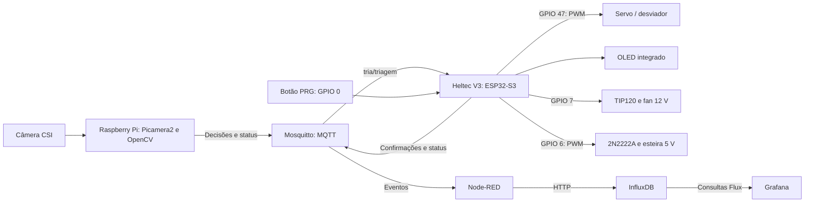
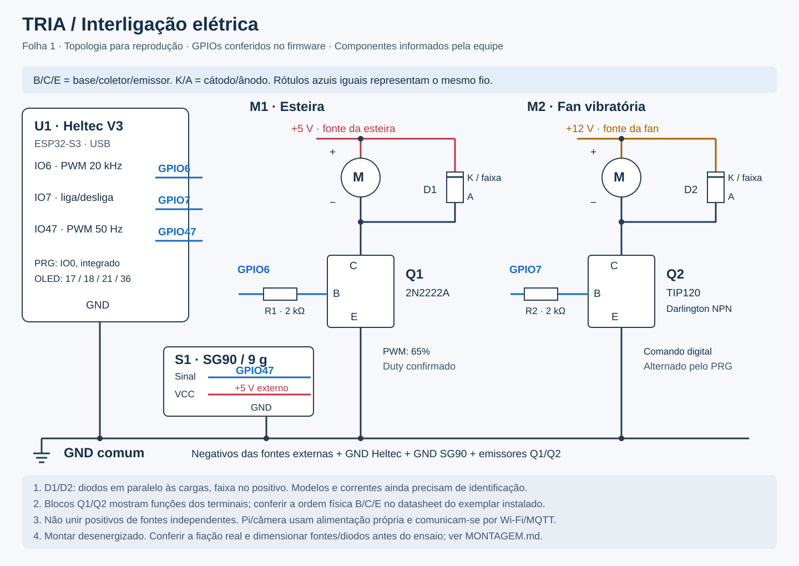

# TRIA - Triagem Visual Integrada de Componentes

**TCC · PNAAT 2026 · Cenário 2 · Equipe Os guri do pinati**

O TRIA é uma prova de conceito de triagem física com visão computacional e IoT. Responde ao [Cenário 2](docs/Cen%C3%A1rios.pdf): componentes misturados, em posições variadas ou sobrepostos prejudicam a alimentação das etapas seguintes de uma linha de manufatura. Na bancada, uma plataforma vibratória pré-separa placas de MDF; o Raspberry Pi reconhece seus símbolos e envia decisões por MQTT ao ESP32, que controla o desviador. A stack **MING — Mosquitto, InfluxDB, Node-RED e Grafana** registra e apresenta os eventos na rede local.

Este README reúne a montagem, a instalação, a calibração e a validação necessárias para reproduzir a solução.

## Sumário

1. [Funcionamento e arquitetura](#1-funcionamento-e-arquitetura)
2. [Organização do repositório](#2-organização-do-repositório)
3. [Materiais e montagem](#3-materiais-e-montagem)
4. [Preparação do ambiente](#4-preparação-do-ambiente)
5. [Instalação e configuração](#5-instalação-e-configuração)
6. [Calibração e operação](#6-calibração-e-operação)
7. [Comunicação MQTT](#7-comunicação-mqtt)
8. [Testes e critérios de aceite](#8-testes-e-critérios-de-aceite)
9. [Solução de problemas](#9-solução-de-problemas)
10. [Limites, reprodutibilidade e referências](#10-limites-reprodutibilidade-e-referências)

## 1. Funcionamento e arquitetura

**Percurso físico:** peças misturadas → plataforma vibratória → limitador de altura e rampa → esteira → inspeção por câmera → desviador → saídas A/B/C.

| Símbolo central no MDF | Classe MQTT | Destino | `defeito` |
|---|---|---|---|
| Quadrado | `QUADRADO` | A | `false` |
| Triângulo | `TRIÂNGULO` | B | `false` |
| X | `QUADRADO_COM_X` | C, descarte | `true` |

As classes preservam os nomes do [levantamento de requisitos](docs/TRIA_Entrega_1_Levantamento_de_Requisitos_PoC_Fisica.pdf). A visão identifica o **símbolo central**, após localizar a placa. O X representa descarte na demonstração; não há diagnóstico de defeitos físicos arbitrários.



1. A esteira inicia no percentual configurado. A fan inicia desligada; **cada toque no PRG alterna entre ligar e desligar**, com debounce de 30 ms.
2. O Pi detecta MDF na região de interesse (**ROI**), corrige a perspectiva e coleta amostras durante a passagem. A presença e a ausência são confirmadas por três quadros consecutivos.
3. **A classificação acontece após a peça sair da ROI.** Uma classificação válida gera um evento; uma falha é registrada no terminal, sem comando automático de descarte.
4. O ESP32 move o servo ao receber o destino e publica uma confirmação após a espera de estabilização. Em paralelo, o Node-RED valida e registra o evento para consulta no Grafana.

O broker participa da atuação; o dashboard apenas monitora. A câmera pressupõe peças separadas por um intervalo livre, obtido pela pré-separação mecânica. As restrições da implementação estão reunidas na seção 10.

## 2. Organização do repositório

| Caminho | Responsabilidade |
|---|---|
| [docs/](docs/) | Referências, [montagem e ficha física](docs/hardware/MONTAGEM.md), [guia do código](docs/DESENVOLVIMENTO.md) e [evidências de testes](docs/VALIDACAO.md) |
| [pi/main.py](pi/main.py) | Captura, ROI, ciclo de passagem e visualização |
| [pi/classifier.py](pi/classifier.py) | Segmentação e classificação geométrica |
| [pi/image_io.py](pi/image_io.py) | Leitura/escrita de imagens com caminhos acentuados |
| [pi/mqtt_publisher.py](pi/mqtt_publisher.py) | Publicação de decisões e menu de teste |
| [pi/config.py](pi/config.py) e [requirements.txt](pi/requirements.txt) | Parâmetros e dependências Python |
| [pi/tests/](pi/tests/) e [evaluate_videos.py](pi/evaluate_videos.py) | Testes, imagens, vídeos e avaliação por gabarito |
| [tria-esp/main/](tria-esp/main/) | Inicialização, menuconfig e manifesto de dependências |
| [tria-esp/components/](tria-esp/components/) | Módulos `servo`, `tria_actuator`, `vibration`, `conveyor`, `tria_network` e `tria_display` |
| [tria-esp/dependencies.lock](tria-esp/dependencies.lock) | Versões resolvidas: ESP-IDF 5.5.5 e u8g2 0.1.4 |
| [tria-esp/sdkconfig.defaults](tria-esp/sdkconfig.defaults) | Perfil inicial da bancada, com GPIOs e PWM de 65%, sem credenciais |
| [ming/docker-compose.yml](ming/docker-compose.yml) | Serviços, rede e volumes MING |
| [ming/nodered/flows.json](ming/nodered/flows.json) | Validação, deduplicação e gravação no banco |
| [ming/grafana/](ming/grafana/) | Fonte InfluxDB e dashboard provisionados |
| [ming/mosquitto/mosquitto.conf](ming/mosquitto/mosquitto.conf) | Configuração do broker |

## 3. Materiais e montagem

### 3.1 Lista de materiais

| Quantidade | Item | Especificação |
|---|---|---|
| 1 conjunto | Raspberry Pi 5, 8 GB | microSD (128 GB no kit previsto), fonte, refrigeração e leitor |
| 1 | Câmera CSI V1.3, 5 MP | Cabo adaptador compatível com o Pi 5 |
| 1 | Heltec WiFi LoRa 32 V3 | ESP32-S3, OLED e PRG integrados; cabo USB de dados |
| 1 conjunto | Esteira e transistor | Motor DC de **5 V** e **2N2222A** |
| 1 conjunto | Vibrador e transistor | Fan de **12 V** e **TIP120** |
| 2 de cada | Resistores e diodos | **2 kΩ** em cada base; um diodo de proteção por carga |
| 1 | Microservo **SG90 de 9 g** | Alimentação externa regulada de 5 V; sinal no GPIO 47 |
| Conforme cargas | Fontes reguladas | 5 V e 12 V, dimensionadas para partida e operação simultânea |
| 1 conjunto | Mecânica de MDF | Plataforma, limitador de altura, rampa, aleta e três saídas |
| 1 conjunto | Peças de ensaio | Placas de MDF com quadrado, triângulo e X contrastantes |
| Conforme montagem | Apoio | Fios/conectores, fixação, suporte da câmera, luz difusa e fundo fosco |
| 1 de cada | Infraestrutura | Rede local, computador de apoio e multímetro |

Tensões, transistores, resistores, diodos presentes, **SG90** e **PWM de 65%** foram confirmados pela equipe. A [ficha versionada](docs/hardware/bancada.json) registra esses dados e os campos ainda sem medição: correntes, modelos dos diodos e dimensões.

### 3.2 Alimentação e GPIOs

Monte com as fontes desligadas. Alimente a Heltec por USB e as cargas por fontes externas, unindo **todos os negativos das cargas ao GND da Heltec**. Não una os positivos de 5 V e 12 V nem fontes independentes em paralelo. Os GPIOs trabalham com sinais de **3,3 V**: motores não devem ser ligados diretamente a eles.

O Pi usa sua própria fonte e comunica-se pela rede, sem ligação GPIO adicional à Heltec. Os números abaixo indicam sinais IO, não posições físicas no conector.

| Função | GPIO | Conexão / comportamento |
|---|---:|---|
| Esteira | **6** | Resistor de 2 kΩ → base do 2N2222A; PWM de **20 kHz** |
| Fan | **7** | Resistor de 2 kΩ → base do TIP120; saída digital liga/desliga |
| Servo | **47** | Fio de sinal; PWM de **50 Hz** |
| PRG | **0** | Botão integrado, ativo em nível baixo |
| OLED SDA / SCL | **17 / 18** | Ligações internas I²C |
| OLED reset / Vext | **21 / 36** | Ligações internas; Vext ativo em nível baixo |
| Referência | **GND** | Emissores, negativo das fontes e GND do servo |

Preserve as ligações internas do botão e OLED. Confira a revisão no [pinout da Heltec V3](https://heltec.org/project/wifi-lora-32-v3/). Os pinos são configurados em `idf.py menuconfig`, conforme [Kconfig.projbuild](tria-esp/main/Kconfig.projbuild).

### 3.3 Esquema dos motores

Os dois estágios usam a mesma topologia: transistor como chave no negativo da carga. **B = base; C = coletor; E = emissor; K = cátodo; A = ânodo.**



[Abrir esquema vetorial](docs/hardware/esquema-eletrico.svg) · [Conferência elétrica e medidas mecânicas](docs/hardware/MONTAGEM.md). Os blocos B/C/E identificam funções elétricas, não a ordem física das pernas dos transistores.

| Ligação | Esteira: Q1 = 2N2222A, D1 | Fan: Q2 = TIP120, D2 |
|---|---|---|
| Positivo da fonte | **+5 V** → positivo do motor e cátodo/faixa de D1 | **+12 V** → positivo da fan e cátodo/faixa de D2 |
| Negativo da carga | Negativo do motor → coletor de Q1 e ânodo de D1 | Negativo da fan → coletor de Q2 e ânodo de D2 |
| Comando | **GPIO 6 → R1 de 2 kΩ → base de Q1** | **GPIO 7 → R2 de 2 kΩ → base de Q2** |
| Retorno | Emissor de Q1 → GND comum | Emissor de Q2 → GND comum |
| Referência da fonte | Negativo da fonte de 5 V → GND da Heltec | Negativo da fonte de 12 V → GND da Heltec |

Os diodos ficam **em paralelo com a carga, com a faixa no positivo**. Se a fan tiver fios extras de tacômetro/controle, identifique-os pelo fabricante; o firmware utiliza apenas seu acionamento de alimentação.

Confira B/C/E no datasheet do componente real. O [2N2222A da ST](https://www.st.com/resource/en/datasheet/2n2222a.pdf) é TO-18 metálico; sua pinagem não deve ser presumida para uma versão plástica. No [TIP120 onsemi TO-220](https://www.onsemi.com/pdf/datasheet/tip120-d.pdf), 1 = B, 2 = C, 3 = E e a aba é o coletor, respeitando a orientação do desenho do fabricante.

**Antes de energizar:** dimensione fontes e diodos pelas correntes, inclusive de partida; D1 também deve ser adequado ao PWM de 20 kHz. O resistor de 2 kΩ fornece aproximadamente **1,25 mA** à base de Q1, supondo 3,3 V no GPIO e 0,8 V em B–E. Isso não garante saturação para qualquer motor: confira corrente, tensão C–E e aquecimento antes de alterar o resistor. No TIP120, verifique também a queda de tensão e a partida da fan. O diodo interno do transistor não substitui D2.

### 3.4 Servo e montagem mecânica

| Fio do servo | Conectar a |
|---|---|
| VCC, normalmente vermelho | Fonte regulada de **5 V**, compatível com o modelo |
| GND, normalmente marrom/preto | **GND comum** |
| Sinal, normalmente laranja/amarelo | **GPIO 47** |

O modelo é **SG90**; confirme a identificação dos fios no exemplar instalado. O firmware gera 500–2500 µs para 0–180°; A/B/C em 45°/90°/135° correspondem a aproximadamente 1000/1500/2000 µs. Teste sem a aleta presa, evitando batentes. O [guia do servo](tria-esp/LIGACAO_MICRO_SERVO.md) detalha a ligação e a configuração pelo menuconfig.

1. Fixe a fan sob a plataforma, transferindo a vibração ao MDF e protegendo partes girantes e fios.
2. Ajuste o teto de saída para passar uma placa e impedir duas empilhadas. Para espessura uniforme `t`, a folga deve ficar entre `t` e `2t`, considerando tolerâncias.
3. Posicione a rampa para entregar uma peça por vez à esteira, com símbolo visível.
4. Fixe a câmera fora da estrutura vibratória, com luz difusa e placa inteira visível na ROI.
5. Instale a aleta e identifique A/B/C. Reserve distância **após a saída da ROI** e espaçamento entre peças para completar a atuação.

O [guia de medição](docs/hardware/MONTAGEM.md#medidas-da-estrutura) indica as cotas necessárias. A observação “rampa da altura do MDF” está preservada na ficha, mas não define uma medida em milímetros. As dimensões e os arquivos de corte ainda dependem de levantamento físico.

## 4. Preparação do ambiente

O roteiro usa **Raspberry Pi para visão**, **computador de apoio para MING e gravação do firmware** e **Heltec para atuação**. É possível hospedar MING no Pi, desde que as imagens ARM64 e a capacidade de processamento sejam verificadas.

| Onde | Preparação |
|---|---|
| Pi | Instalar [Raspberry Pi OS 64 bits pelo Imager](https://www.raspberrypi.com/documentation/computers/getting-started.html), com Python ≥ 3.10, usuário e rede configurados. Conectar a câmera com o Pi desligado, conforme o [manual CSI](https://www.raspberrypi.com/documentation/accessories/camera.html). |
| Computador | Instalar Git e [Docker Desktop no Windows](https://docs.docker.com/desktop/setup/install/windows-install/) com WSL 2/contêineres Linux, ou [Docker Engine e Compose v2 no Linux](https://docs.docker.com/engine/install/ubuntu/). |
| Rede | Usar Wi-Fi de **2,4 GHz com WPA2 compatível** para o ESP32, sem isolamento entre clientes. Pi, Heltec e computador devem alcançar o mesmo broker. |
| Ferramentas ESP32 | Preparar **ESP-IDF 5.5.5**, conforme a seção 5.2. Usar cabo USB de dados. |

Descubra os IPs com `ipconfig` no Windows ou `hostname -I` no Linux. Substitua **IP_DO_HOST_MING**, **IP_DO_PI** e **PORTA_SERIAL** nos exemplos. O ESP32 deve usar o IP do computador MING, nunca `localhost`. Dentro do Docker, os nomes `mosquitto` e `influxdb` já estão configurados.

| Serviço | Porta TCP / endereço |
|---|---|
| MQTT | `IP_DO_HOST_MING:1883`; WebSocket disponível em 9001 |
| Node-RED | `http://IP_DO_HOST_MING:1880` |
| InfluxDB | `http://IP_DO_HOST_MING:8086` |
| Grafana | `http://IP_DO_HOST_MING:3000` |
| Câmera web | `http://IP_DO_PI:8081` |

Libere essas portas apenas na rede privada de ensaio. A configuração usa MQTT anônimo e credenciais públicas de demonstração. Internet é necessária para instalar dependências; a operação usa a rede local.

No Pi, instale o Git se necessário:

```bash
sudo apt update
sudo apt install git
```

Clone no Pi e no computador de apoio, em um caminho sem espaços para o ESP-IDF:

```bash
git clone https://github.com/GilvanTWS/TCC-PNAAT.git
cd TCC-PNAAT
git rev-parse HEAD
```

Use a mesma revisão nos dois equipamentos. Se já houver clone, abra a pasta existente. Confira `git --version`, `docker version` e `docker compose version` no computador MING. Os comandos Docker funcionam em Bash e PowerShell; os comandos com `sudo` e `source` são para **Bash no Pi/Linux**.

## 5. Instalação e configuração

Siga a ordem **MING → ESP32 → Pi → calibração**. Cada subseção parte da raiz do repositório, salvo indicação diferente. Mantenha as fontes das cargas desligadas durante a montagem e gravação.

### 5.1 Stack MING

No computador de apoio, com Docker iniciado:

```bash
cd ming
docker compose config --quiet
docker compose pull
docker compose up -d
docker compose ps
docker compose logs --tail=50 mosquitto nodered influxdb grafana
```

Espere os quatro serviços estarem em execução e o InfluxDB concluir a inicialização. A ordem de partida do Compose não garante que o banco já esteja pronto.

| Configuração inicial | Valor |
|---|---|
| Login do Grafana e do InfluxDB | `admin` / `admin123456` |
| Organização / bucket | `tria` / `tria_events` |
| Token | `tria-token-2026` |
| Fonte / dashboard Grafana | **InfluxDB TRIA** / **TRIA - Monitoramento da Triagem**, pasta **TRIA** |

O flow **TRIA - Triagem**, a fonte e o dashboard são provisionados automaticamente. Confira o nó MQTT conectado no Node-RED; painéis vazios são normais antes do primeiro evento. Não é necessário instalar nós adicionais. O `flows.json` está montado como somente leitura: alterações de desenvolvimento pela interface devem ser exportadas para o arquivo versionado.

Em outro terminal, na pasta `ming`, acompanhe as decisões e confirmações; encerre com **Ctrl+C**:

```bash
docker compose exec mosquitto mosquitto_sub -h localhost -t 'tria/#' -q 1 -v
```

### 5.2 Firmware ESP32

**Windows:** use o [instalador ESP-IDF](https://docs.espressif.com/projects/esp-idf/en/v5.5.5/esp32s3/get-started/windows-setup.html), selecione **5.5.5** e abra o terminal **ESP-IDF PowerShell**. O instalador fornece Python, toolchain, CMake e Ninja. Prefira caminho curto, sem espaços ou acentos.

**Linux Debian/Ubuntu:** prepare o ambiente conforme o [guia oficial](https://docs.espressif.com/projects/esp-idf/en/v5.5.5/esp32s3/get-started/linux-macos-setup.html):

```bash
sudo apt update
sudo apt install git wget flex bison gperf python3 python3-pip python3-venv cmake ninja-build ccache libffi-dev libssl-dev dfu-util libusb-1.0-0
mkdir -p "$HOME/esp"
cd "$HOME/esp"
git clone --branch v5.5.5 --recursive https://github.com/espressif/esp-idf.git
cd esp-idf
./install.sh esp32s3
. ./export.sh
```

Nas sessões seguintes, basta ativar `. "$HOME/esp/esp-idf/export.sh"`. Use um ambiente Python separado para o classificador.

**Volte à raiz do repositório**, no terminal ESP-IDF:

```bash
idf.py --version
cd tria-esp
idf.py set-target esp32s3
idf.py menuconfig
```

Confirme a versão **5.5.5**. Use `set-target` na preparação inicial; ele pode reinicializar configurações. Ajuste e salve:

| Menu | Configuração |
|---|---|
| TRIA - Rede | SSID, senha, `mqtt://IP_DO_HOST_MING:1883` e ID `esp32-tria-01` |
| TRIA - Vibracao | PRG **GPIO 0**, fan **GPIO 7**, debounce **30 ms** |
| TRIA - Esteira | **GPIO 6**; duty operacional **65%** |
| TRIA - Atuação (servo) | **GPIO 47**; A/B/C = **45°/90°/135°**; estabilização **500 ms** |
| TRIA - OLED | SDA/SCL/reset/Vext = **17/18/21/36** |
| TRIA - Watchdog de comunicação | Timeout **15 s**; intervalo de status **30 s** |

**PWM da esteira:** **65%**, confirmado pela equipe e versionado em `Kconfig.projbuild` e `sdkconfig.defaults`. Uma configuração `sdkconfig` existente tem precedência: confira o valor no menu e no monitor serial. Use **0%** no primeiro teste elétrico; depois retorne a 65%, compile e grave novamente.

```bash
idf.py build
idf.py -p PORTA_SERIAL flash monitor
```

Identifique a porta em **Gerenciador de Dispositivos → Portas** no Windows, por exemplo `COM3`, ou com `ls /dev/ttyUSB* /dev/ttyACM*` no Linux. Confira cabo, driver da placa e permissões se ela não aparecer. O ESP-IDF obtém automaticamente `nixy4/u8g2`, versão **0.1.4** no lock.

No monitor, confira GPIOs, percentual da esteira e conexão ao broker. O OLED deve indicar que aguarda decisão. Saia com **Ctrl+]**. Mudanças no menuconfig exigem nova compilação/gravação; as credenciais ficam em `tria-esp/sdkconfig`, ignorado pelo Git.

### 5.3 Raspberry Pi e câmera

No Pi, a partir da raiz do repositório:

```bash
sudo apt update
sudo apt install git python3-venv python3-pip python3-dev python3-picamera2 libcap-dev rpicam-apps libgl1 libglib2.0-0
rpicam-hello --list-cameras
rpicam-still --nopreview --timeout 2000 --output /tmp/tria-camera.jpg
```

A câmera deve ser listada e produzir uma foto legível. Depois prepare o ambiente:

```bash
cd pi
python3 -m venv --system-site-packages venv
source venv/bin/activate
TRIA_NUMPY_VERSION=$(python -c "import numpy; print(numpy.__version__)")
TRIA_PICAMERA_VERSION=$(python -c "from importlib.metadata import version; print(version('picamera2'))")
python -m pip install -r requirements.txt "numpy==$TRIA_NUMPY_VERSION" "picamera2==$TRIA_PICAMERA_VERSION"
python -m pip install pytest
python -c "import cv2, numpy, picamera2, paho.mqtt.client; print('Dependencias OK')"
```

O venv acessa as bibliotecas de câmera do sistema. Os parâmetros adicionais preservam NumPy/Picamera2 do apt, deixando o pip selecionar um OpenCV compatível. Esse procedimento segue a [orientação de instalar Picamera2 pelo apt](https://github.com/raspberrypi/picamera2/blob/main/README.md).

Mínimos de `requirements.txt`: **OpenCV 4.8, NumPy 1.24, paho-mqtt 2.0 e Picamera2 0.3.12**. Se os pacotes do sistema estiverem abaixo desses valores, atualize-os pelo apt; não prossiga com erro de instalação/importação.

Edite `pi/config.py` com o IPv4 real do computador MING, **sem** o prefixo `mqtt://`:

```python
MQTT_BROKER = "IP_DO_HOST_MING"
MQTT_PORT = 1883
```

Use `localhost` somente se MING estiver no próprio Pi. O código atual não lê esses valores de um arquivo `.env`. Alinhe o relógio/fuso com o Node-RED, que usa `America/Sao_Paulo` no Compose:

```bash
sudo timedatectl set-timezone America/Sao_Paulo
timedatectl status
```

### 5.4 Conferir cada etapa antes de integrar

Na pasta `pi`, com o venv ativo, execute:

```bash
python main.py --imagem tests/images/q1.jpeg
python main.py --imagem tests/images/t1.jpeg
python main.py --imagem tests/images/x1.jpeg
python -m pytest tests/test_classifier.py -q
```

Resultados esperados: **QUADRADO/A**, **TRIÂNGULO/B** e **QUADRADO_COM_X/C**. Imagens e vídeos não publicam MQTT. A suíte verifica imagens, estados e um vídeo de referência.

Teste a câmera isolada:

```bash
python main.py --web --sem-mqtt
```

Abra `http://IP_DO_PI:8081` e passe uma peça pela ROI. Confira a classificação no terminal após a saída e encerre com **Ctrl+C**.

Para testar atuação e registro, mantenha a esteira desligada, energize o servo com a área livre e execute:

```bash
python mqtt_publisher.py
```

Envie **1 = A**, **2 = B**, **3 = C**. Esses comandos **movimentam o servo e geram registros no banco**. Confira decisão, movimento, OLED, confirmação com o mesmo ID e histórico no Grafana. Aguarde cada movimento; Enter vazio encerra o menu. Separe esses eventos do lote de avaliação.

**Teste sem Pi:** em um computador com Python ≥ 3.10, crie um venv em `pi` e instale apenas `opencv-python>=4.8.0`, `numpy>=1.24.0`, `paho-mqtt>=2.0.0` e `pytest`. Não instale Picamera2. Ative com `.\venv\Scripts\Activate.ps1` no PowerShell ou `source venv/bin/activate` no Bash; os comandos de imagens/vídeos funcionam sem captura CSI.

## 6. Calibração e operação

### 6.1 Ajustes de bancada

| Parâmetro | Padrão / ajuste |
|---|---|
| Câmera | **640 × 480**, taxa solicitada de **30 fps** |
| ROI | Central: **160 48 320 384** nessa resolução; ajustar com `--roi X Y W H` |
| MDF em HSV | `HSV_MDF_MIN = (5, 80, 30)`; `HSV_MDF_MAX = (28, 255, 255)`, em `pi/config.py` |
| Presença/ausência | Três quadros consecutivos para cada transição; garantir intervalo entre peças |
| Esteira | Ajustar duty no menuconfig e medir velocidade real; referência aproximada de **65%** |
| Servo | Calibrar ângulos A/B/C e espera no menuconfig, com as calhas montadas |

Fixe câmera e iluminação após os ajustes. A placa deve caber inteira na ROI, com símbolo central contrastante. Para testar uma ROI explícita, use `python main.py --web --sem-mqtt --roi 160 48 320 384`.

**Sincronização:** meça o percurso restante **da saída da ROI até a aleta**. O tempo `distância / velocidade` deve cobrir confirmação de ausência, classificação, rede, movimento e a margem de **0,3 s** prevista no ensaio. Garanta que uma peça libere o desviador antes de uma nova decisão mudar sua posição. Os valores de distância/velocidade em `pi/config.py` não controlam a esteira, e os ângulos nesse arquivo não reconfiguram o ESP32.

### 6.2 Operar e encerrar

1. Inicie MING, ligue a Heltec e confira conexão MQTT. Com o circuito verificado e a linha vazia, energize as cargas. **A esteira inicia no duty gravado; o PRG controla apenas a fan.**
2. No Pi, na pasta `pi`, ative `source venv/bin/activate` e execute **`python main.py --web`**.
3. Abra a câmera e o Grafana. Se o terminal indicar execução sem MQTT, corrija a rede e reinicie o programa antes do ensaio.
4. Passe uma peça de cada classe, comparando ID, classe, saída física e registro. Acione PRG para alimentar o lote e registre falhas/intervenções.
5. Ao terminar, desligue a fan com outro toque, esvazie a linha e **desligue as fontes das cargas**. Encerrar o Python ou perder MQTT não para os motores.
6. Encerre o Python com **Ctrl+C**. Em `ming`, use `docker compose stop`; retome com `docker compose start`. Desligue o Pi com `sudo shutdown -h now` antes de retirar sua alimentação.

| Modo alternativo, na pasta `pi` | Comando |
|---|---|
| Janela local | `python main.py` |
| Sem interface | `python main.py --sem-janela` |
| Outra porta web | `python main.py --web --porta-web 8082` |

Os volumes persistem após `docker compose down`, mas são removidos se for acrescentado `-v`. Preserve os dados dos ensaios antes de qualquer limpeza ou migração.

## 7. Comunicação MQTT

| Tópico | Publica → consome | QoS / retenção |
|---|---|---|
| `tria/triagem` | Pi → ESP32 e Node-RED | 1 / não |
| `tria/status/pi` | Pi → Debug do Node-RED | 1 / sim |
| `tria/status/esp32` | ESP32 → cliente de diagnóstico | 1 / sim, com Last Will |
| `tria/atuador` | ESP32 → cliente de diagnóstico | 1 / não |

Exemplo de decisão; ID e horário são gerados para cada evento:

```json
{
  "id_evento": "pi-abc123def456",
  "horario": "2026-09-16T10:30:00.123456",
  "classe": "QUADRADO",
  "destino": "A",
  "defeito": false,
  "instante_atuacao": 3.3,
  "tempo_processamento_ms": 45.0
}
```

O contrato principal contém `id_evento`, `horario`, `classe`, `destino` e `defeito` booleano. Preserve as classes exatas da seção 1, incluindo o acento de `TRIÂNGULO`. O tempo de processamento é opcional e mede a classificação, não o ciclo físico completo.

O ESP32 atua imediatamente ao receber a decisão. `instante_atuacao`, calculado como distância/velocidade + margem, é informativo: não agenda o servo nem é gravado pelo flow. A confirmação devolve o mesmo ID, classe, destino, `posicao_comandada` e `estado_servo: "estabilizado"`, após a espera configurada.

O Node-RED grava em **organização `tria`, bucket `tria_events`, measurement `triagem`**, com precisão de milissegundos. Sucesso na escrita corresponde a **HTTP 204**. O Grafana apresenta contagens, classes/destinos, defeitos, produção por minuto, tempo médio e histórico.

QoS 1 admite reentregas. Publique decisões **sem retenção**, evitando comandos antigos na reconexão. As limitações de validação, deduplicação e status estão na seção 10.

## 8. Testes e critérios de aceite

### 8.1 Vídeos e avaliação automática

A [validação registrada](docs/VALIDACAO.md) inclui **12 testes aprovados** e **76 acertos em 80 peças esperadas (95%)** nos cinco vídeos mistos com gabarito. Há duas trocas, duas perdas e um evento extra; esses resultados não substituem o aceite físico. O [ambiente de teste com versões fixas](pi/requirements-test.txt) permite repetir a avaliação em computador sem câmera.

Na pasta `pi`, com o venv ativo, escolha um modo:

```bash
# Rever um ensaio, sem publicar MQTT
python main.py --video tests/videos/misturado01.mp4 --web

# Avaliar os vídeos com gabaritos disponíveis
python evaluate_videos.py tests/videos
```

Os arquivos `misturado*.txt` contêm uma classe esperada por linha. O avaliador informa acertos, trocas, perdas e extras. Para vídeos de classe única sem TXT, informe o total real; **o exemplo abaixo só vale se cada vídeo sem gabarito contiver dez peças**:

```bash
python evaluate_videos.py tests/videos --total-classe 10 --csv tria-avaliacao.csv
```

Se os totais variarem, avalie os arquivos separadamente ou forneça gabaritos individuais. Reutilize `--roi X Y W H` quando a captura tiver ROI manual.

### 8.2 Aceite da bancada

Os critérios são **metas do levantamento**, não resultados já comprovados. Valide em ordem: montagem/fontes → motores e servo → visão isolada → MQTT/registro → fluxo completo.

| ID | Ensaio e meta |
|---|---|
| RF01 | 20 passagens individuais: ≥ 19 ciclos válidos, no máximo um evento por peça e log/imagem associado |
| RF02 / RF03 | 20 apresentações por classe, com orientações variadas: ≥ 18 acertos em cada classe |
| RF04 / RNF02 | 30 eventos: ≥ 29 entregas consistentes ao ESP32 e Node-RED; testar rejeição de mensagens inválidas |
| RF05 | 30 comandos, dez por posição: ≥ 27 atuações corretas antes da chegada da peça |
| RF06 | 30 peças, dez por classe: ≥ 27 na saída correta |
| RF07 | Dez entradas com contato/sobreposição: ≥ oito chegam separadas à inspeção |
| RF08 / RF09 | 30 IDs únicos: exatamente 30 registros; painéis conferem com a base |
| RF10 | 15 ciclos mistos: ≥ 13 com saída física e registro corretos |
| RNF01 | 20 ciclos: ≥ 18 com servo estabilizado pelo menos 0,3 s antes da chegada |
| RNF03 | Operar por 15 minutos ou 30 peças, o que terminar por último, sem reinício manual |
| RNF04 | Interromper MQTT por 15 s, sem alimentar peças; após restaurar, reconectar ≤ 30 s, sem executar comando antigo |
| RNF05 | 30 IDs + dez reenvios idênticos: manter 30 registros, dentro da janela de deduplicação e sem reiniciar Node-RED |
| RNF06 | Operar 15 minutos sem Internet, mantendo a rede local |

Registre por peça: **classe esperada, classe detectada, ID, destino comandado, saída real, presença no banco e etapa de eventual falha**. Guarde logs MQTT, vídeo/fotos e CSV, associados à revisão Git e à calibração. A confirmação MQTT não substitui observar o servo; ela também não inclui `defeito`, que deve ser conferido no evento original e no banco. Faça o teste de duplicatas sem peças na linha.

Para contar registros no **Data Explorer do InfluxDB**, ajuste o intervalo ao lote:

```flux
from(bucket: "tria_events")
  |> range(start: -15m)
  |> filter(fn: (r) => r._measurement == "triagem" and r._field == "id_evento")
  |> count()
```

Exclua do intervalo os comandos manuais de teste. Imagens, vídeos e testes versionados ajudam a reproduzir a avaliação; a aprovação física exige os registros do ensaio.

## 9. Solução de problemas

| Sintoma | Verificar / corrigir |
|---|---|
| MING não inicia ou porta ocupada | Iniciar Docker; consultar `docker compose ps` e `docker compose logs --tail=100`; conferir portas e permissões de `ming/nodered/data` |
| `idf.py` ausente / falha na gravação | Abrir terminal ESP-IDF; conferir versão, cabo de dados, driver, porta e outro monitor serial aberto. No Linux, conferir acesso ao grupo `dialout` |
| ESP32 fica no bootloader / OLED apagado | Soltar PRG antes de reiniciar; conferir revisão da placa e GPIOs do OLED |
| Esteira não parte ou transistor aquece | Desenergizar; verificar fonte sob carga, corrente, B/C/E, diodo, resistor e atrito. Duty não equivale à velocidade mecânica |
| Fan não desliga ao soltar PRG | Pressionar novamente: o controle alterna a cada toque |
| Servo treme / placa reinicia | Conferir fonte, GND comum, cabos, desacoplamento e travamento mecânico |
| Câmera ausente / erro de importação | Conferir CSI com o Pi desligado; testar `rpicam-hello --list-cameras`. Instalar Picamera2 pelo apt e preservar as versões do sistema no venv |
| Janela falha por SSH | Usar `--web` ou `--sem-janela` |
| Peças não reconhecidas ou contadas juntas | Conferir luz, símbolo central, HSV, ROI e intervalo livre entre placas |
| Classe certa, saída errada | Testar A/B/C manualmente; calibrar ângulos, percurso após a ROI e espaçamento |
| Visão funciona sem atuar | Conferir IP/broker, `tria/triagem` e Heltec; reiniciar o Python se ele iniciou sem MQTT |
| Evento ausente no Grafana | Conferir Debug/logs do Node-RED, HTTP 204, token, bucket, relógios e intervalo do dashboard |
| Credenciais do Compose não alteram banco existente | Variáveis de inicialização valem para volume novo; atualizar a instalação existente sem apagar o histórico |

## 10. Limites, reprodutibilidade e referências

### 10.1 Limites conhecidos

| Aspecto | Condição da implementação |
|---|---|
| Escopo | PoC com três símbolos em MDF; sem certificação industrial, peças arbitrárias, Deep Learning, CLP/MES/ERP ou uso do rádio LoRa |
| Montagem | SG90 e PWM de 65% confirmados; correntes, modelos dos diodos e dimensões ainda pendentes na [ficha física](docs/hardware/bancada.json) |
| Atuação | Sem sensor de posição, agendamento ou rastreamento de múltiplas peças; depende da calibração e do espaçamento |
| Falhas | Não há parada automática dos motores por falha de rede. Classificação inválida não aciona descarte |
| Deduplicação/validação | Node-RED guarda os últimos 100 IDs em memória; ESP32 não deduplica nem valida integralmente classe/destino/defeito |
| Persistência | Flow sem fila persistente/retentativa, com ID registrado antes da confirmação de escrita. Eventos no mesmo milissegundo podem colidir no banco |
| Status | ESP32 sinaliza timeout após 15 s sem decisões, inclusive sem peças. Pi publica status ao encerrar o laço, ainda disponível, sem Last Will; não é um sinal periódico de atividade |
| Supervisão | Flow não consome confirmação do servo/status do ESP32; acompanhe-os no assinante MQTT |

### 10.2 Registro para reproduzir o ensaio

Guarde **revisão Git, versões, calibração e resultados reais**. O firmware tem lock e perfil versionado; a avaliação offline tem [dependências fixas e evidências](docs/VALIDACAO.md). O ambiente Pi usa versões mínimas e o Compose usa tags mutáveis, incluindo `latest` para Node-RED e Grafana. Para reproduzir a mesma combinação, registre:

| Onde | Comandos / informações |
|---|---|
| Repositório | `git rev-parse HEAD` e `git status --short` |
| Pi, venv ativo | `cat /etc/os-release`, `python --version`, `python -m pip freeze` e `dpkg-query -W python3-picamera2 python3-libcamera` |
| ESP32 | `idf.py --version`; GPIOs, duty, ângulos e espera, sem credenciais |
| MING | `docker version`, `docker compose version` e `docker compose images` |
| Bancada | Fontes/correntes, modelos, dimensões, ROI, iluminação, HSV, velocidade e distância até a aleta |

Para identificar exatamente as imagens instaladas:

```bash
docker image inspect eclipse-mosquitto:2.0 influxdb:2.7 nodered/node-red:latest grafana/grafana:latest --format '{{json .RepoDigests}}'
```

Use essas versões/digests na réplica. Mantenha senhas fora do versionamento e exporte evidências do banco: volumes e dados locais não acompanham um clone. O teste final de reprodutibilidade consiste em repetir este roteiro em outro ambiente, incluindo uma peça de cada classe, registro, encerramento e retomada.

### 10.3 Equipe e referências

**Os guri do pinati:** Claylton Demésio Muniz Silva, Gilvan Alves Pastor Júnior, Ana Beatriz Batista Caitano e Antonio Rafael Oliveira da Cunha.

- [Apostila TCC PNAAT 2026](docs/Apostila%20Trabalho%20de%20Conclus%C3%A3o%20da%20Capacita%C3%A7%C3%A3o%20-%20PNAAT%202026.pdf): documentação e reprodutibilidade, pp. 16–20; integração e qualidade, pp. 28–31.
- [Cenários — cenário 2](docs/Cen%C3%A1rios.pdf) e [levantamento TRIA](docs/TRIA_Entrega_1_Levantamento_de_Requisitos_PoC_Fisica.pdf): problema, escopo e critérios de aceite.
- [Roteiro do vídeo/pitch](docs/RoteiroVideoPitch.pdf): apoio à apresentação.
- Documentação técnica: [ESP-IDF 5.5.5](https://docs.espressif.com/projects/esp-idf/en/v5.5.5/esp32s3/get-started/index.html) e [câmera/Picamera2](https://www.raspberrypi.com/documentation/computers/camera_software.html).

[Licença MIT](LICENSE) · Copyright 2026 GilvanTWS and Claylton-Muniz.

