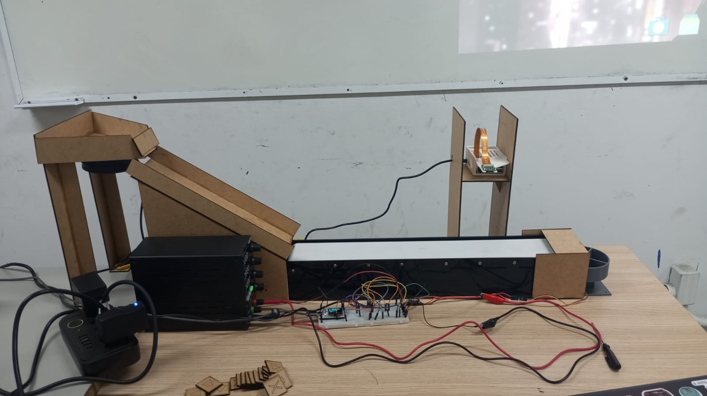

# Montagem e ficha da bancada

O [README](../../README.md#3-materiais-e-montagem) contém a sequência de montagem e a tabela fio a fio. O [esquema elétrico](esquema-eletrico.svg) mostra todos os circuitos externos e o GND comum. A [ficha da bancada](bancada.json) separa informações confirmadas, parâmetros do software e medições ainda necessárias; `null` significa **não medido**, nunca zero.

## Componentes confirmados

| Circuito | Componentes / comando |
|---|---|
| Esteira | Motor 5 V, Q1 2N2222A, R1 2 kΩ, D1 de proteção; GPIO 6, 20 kHz, **65%** |
| Vibração | Fan 12 V, Q2 TIP120, R2 2 kΩ, D2 de proteção; GPIO 7, liga/desliga pelo PRG |
| Desviador | **SG90 de 9 g**, sinal GPIO 47; alimentação externa prevista de 5 V |

Os números B/C/E do encapsulamento não são dedutíveis somente do nome do transistor. Identifique o fabricante e confronte a pinagem com seu datasheet. No esquema, os blocos Q1/Q2 identificam funções elétricas, sem representar a disposição das pernas.

D1/D2 foram confirmados pela equipe, mas seus modelos são desconhecidos. Registre a marcação do corpo e uma foto legível; se não houver identificação, selecione e registre um componente dimensionado antes de reproduzir o estágio. Não atribua um modelo fictício ao diodo existente. D1 precisa suportar o chaveamento a 20 kHz, além da corrente da carga e tensão reversa. A presença do diodo, sozinha, não comprova esse dimensionamento.

## Conferência elétrica antes de operar

1. Desenergize. Confira cada linha da tabela fio a fio do README e a continuidade do GND comum. Identifique os fios de cada tensão; mantenha separados os positivos de fontes independentes.
2. Identifique fontes e cargas pelas etiquetas/datasheets; registre capacidades nominais e valores medidos em campos distintos. Verifique a orientação de cada diodo: **K/faixa no positivo**, A no coletor/negativo da carga.
3. Grave inicialmente com duty da esteira em **0%**, para conferir o circuito sem partida automática. O perfil operacional versionado é **65%**, que fará o motor iniciar ao energizar.
4. Teste cada carga separadamente, depois juntas. Registre corrente de regime/partida com instrumento e faixa adequados; uma fonte com leitura/limitação ajuda no teste. Corrente se mede em série: nunca coloque o amperímetro diretamente entre os polos da fonte. Não bloqueie o motor para simular partida.
5. Confira tensão na carga, queda C–E e aquecimento. R1/R2 = 2 kΩ são valores da bancada, não prova de saturação dos transistores para qualquer motor/fan. Só aceite o conjunto após comparar as medições com os limites dos componentes reais.
6. Teste o SG90 sem a aleta e siga o [guia do servo](../../tria-esp/LIGACAO_MICRO_SERVO.md). Reponha 65%, compile/grave e registre os ângulos finais após a calibração.

## Medidas da estrutura

A informação “rampa da altura do MDF” foi preservada literalmente na ficha. Ela não define espessura, altura de montagem, desnível ou inclinação.

| Medida | Como registrar para outra pessoa reconstruir |
|---|---|
| Base, plataforma e esteira | Comprimento × largura; espessura de cada chapa, cotas de fixação e altura relativa ao tampo |
| Peças e símbolos | Comprimento × largura × espessura; tamanho/traço do símbolo e foto frontal com régua |
| Limitador | Vão livre entre plataforma e teto; deve passar uma peça e impedir duas empilhadas |
| Rampa | Comprimento útil, largura e desnível vertical **entre entrada e saída**; posição em relação à esteira |
| Câmera | Altura da lente até o plano da esteira, posição/orientação, resolução e ROI `(x, y, largura, altura)` em pixels |
| Desviador/saídas | Distância da **saída da ROI** até o ponto de contato da aleta; tamanho da aleta, posição do eixo e largura/posição de A/B/C |

Anote em milímetros na ficha, fotografe vista superior/lateral com régua e identifique os pontos de referência. Um croqui cotado feito a partir da bancada pode documentar peças cortadas manualmente; SVG/DXF de corte só deve ser criado depois de obter essas medidas. Não há arquivo de corte validado nesta entrega.

## Calibração a registrar

Com o duty em 65%, meça o deslocamento de uma peça em um percurso conhecido: `velocidade = distância / tempo`. Repita sob carga; duty não equivale a velocidade linear. Meça a distância a partir da borda de saída da ROI, pois a classificação ocorre após confirmar a ausência da peça.

O tempo disponível `distância / velocidade` deve superar confirmação de ausência + processamento + entrega MQTT + movimento do servo + margem de 0,3 s. Verifique isso em vídeo do ensaio; não assuma que os tempos de configuração medem o comportamento físico. Registre também o intervalo livre entre placas para não fundir duas passagens.

Preencha os ângulos A/B/C medidos em `calibracao_medida`, atualize o menuconfig e transcreva os valores aprovados para `sdkconfig.defaults`, preservando credenciais fora do Git. Registre ROI, HSV, iluminação, data, operador, revisão e evidências conforme os testes de aceite do README.

## Condição de fechamento

O esquema e a configuração permitem reproduzir as conexões e o software. A reprodução dimensional e o dimensionamento elétrico permanecem pendentes enquanto a ficha não contiver medidas, fontes/correntes e identificação dos diodos. Um teste completo em outro ambiente deve confirmar captura → decisão → saída física → registro no banco. Documentar essas pendências é necessário; preenchê-las com valores supostos não comprova reprodutibilidade.
